ITU-T 

X.200 

TELECOMMUNICATION 

(07/94) 

STANDARDIZATION SECTOR 

OF ITU 

DATA NETWORKS AND OPEN SYSTEM COMMUNICATIONS 

OPEN SYSTEMS INTERCONNECTION - MODEL AND NOTATION 

INFORMATION TECHNOLOGY - OPEN SYSTEMS INTERCONNECTION - BASIC REFERENCE MODEL: THE BASIC MODEL 

ITU-T Recommendation X.200 

(Previously "CCITT Recommendation") 

# Foreword

ITU (International Telecommunication Union) is the United Nations Specialized Agency in the field of telecommunications. The ITU Telecommunication Standardization Sector (ITU-T) is a permanent organ of the ITU. Some 179 member countries, 84 telecom operating entities, 145 scientific and industrial organizations and 38 international organizations participate in ITU-T which is the body which sets world telecommunications standards (Recommendations). 

The approval of Recommendations by the Members of ITU-T is covered by the procedure laid down in WTSC Resolution No. 1 (Helsinki, 1993). In addition, the World Telecommunication Standardization Conference (WTSC), which meets every four years, approves Recommendations submitted to it and establishes the study programme for the following period. 

In some areas of information technology which fall within ITU-T's purview, the necessary standards are prepared on a collaborative basis with ISO and IEC. The text of ITU-T Recommendation X.200 was approved on 1st of July 1994. The identical text is also published as ISO/IEC International Standard 7498-1. 

# NOTE

In this Recommendation, the expression "Administration" is used for conciseness to indicate both a telecommunication administration and a recognized operating agency. 

# CONTENTS

Page 

1 Scope 1 

2 Definitions 2 

3 Notation. 2 

4 Introduction to Open Systems Interconnection (OSI) 2 

4.1 Definitions 2 

4.2 Open System Interconnection Environment 3 

4.3 Modelling the OSI Environment 4 

5 Concepts of a layered architecture 5 

5.1 Introduction 5 

5.2 Principles of layering 6 

5.3 Communication between peer-entities 9 

5.4 Identifiers 13 

5.5 Properties of service-access-points 14 

5.6 Data-units 15 

5.7 The nature of the (N)-service 16 

5.8 Elements of layer operation 16 

5.9 Routing 27 

5.10 Quality Of Service (QOS) 27 

6 Introduction to the specific OSI layers 28 

6.1 Specific layers 28 

6.2 The principles used to determine the seven layers in the Reference Model 29 

6.3 Layer descriptions 30 

6.4 Combinations of connection-mode and connectionless-mode 30 

6.5 Configurations of OSI Open Systems 31 

7 Detailed description of the resulting OSI architecture 32 

7.1 Application Layer 32 

7.2 Presentation Layer 33 

7.3 Session Layer 34 

7.4 Transport Layer 37 

7.5 Network Layer 41 

7.6 Data Link Layer 46 

7.7 Physical Layer 49 

8 Management aspects of OSI 52 

8.1 Definitions 52 

8.2 Introduction 53 

8.3 Categories of management activities 53 

8.4 Principles for positioning management functions 54 

9 Compliance and Consistency with this reference model 54 

9.1 Definitions 54 

9.2 Application of consistency and compliance requirements 55 

Annex A-Brief explanation of how the layers were chosen 56 

Annex B - Alphabetical index to definitions 57 

# Summary

This reference model provides a common basis for the coordination of standards development for the purpose of systems interconnection, while allowing existing standards to be placed into perspective within the overall reference model. It also identifies areas for developing and improving standards and provides a common reference for maintaining consistency among all related standards. The text was developed jointly with ISO/IEC and the main intent of this revision is to introduce the joint text, which incorporates inclusion of the concept of connectionless transmission, in addition to a number of technical and editorial refinements. 

# INFORMATION TECHNOLOGY - OPEN SYSTEMS INTERCONNECTION - BASIC REFERENCE MODEL: THE BASIC MODEL

# 1 Scope

1.1 The purpose of this Reference Model of Open Systems Interconnection is to provide a common basis for the coordination of standards development for the purpose of systems interconnection, while allowing existing standards to be placed into perspective within the overall Reference Model. 

1.2 The term Open Systems Interconnection (OSI) qualifies standards for the exchange of information among systems that are "open" to one another for this purpose by virtue of their mutual use of the applicable standards. 

1.3 The fact that a system is open does not imply any particular systems implementation, technology or means of interconnection, but refers to the mutual recognition and support of the applicable standards. 

1.4 It is also the purpose of this Reference Model to identify areas for developing or improving standards, and to provide a common reference for maintaining consistency of all related standards. It is not the intent of this Reference Model either to serve as an implementation specification, or to be a basis for appraising the conformance of actual implementations, or to provide a sufficient level of detail to define precisely the services and protocols of the interconnection architecture. Rather, this Reference Model provides a conceptual and functional framework which allows international teams of experts to work productively and independently on the development of standards for each layer of the Reference Model for OSI. 

1.5 The Reference Model has sufficient flexibility to accommodate advances in technology and expansion in user demands. This flexibility is also intended to allow the phased transition from existing implementations to OSI standards. 

1.6 While the scope of the general architectural principles required for OSI is very broad, this Reference Model is primarily concerned with systems comprising terminals, computers, and associated devices and the means for transferring information between such systems. Other aspects of OSI requiring attention are described briefly (see 4.2). 

1.7 The description of the Basic Reference Model of OSI is developed in stages: 

1.8 Clause 4 establishes the reasons for Open Systems Interconnection, defines what is being connected, the scope of the interconnection, and describes the modelling principles used in OSI. 

1.9 Clause 5 describes the general nature of the architecture of the Reference Model; namely that it is layered, what layering means, and the principles used to describe layers. 

1.10 Clause 6 names, and introduces the specific layers of the architecture. 

1.11 Clause 7 provides the description of the specific layers. 

1.12 Clause 8 provides the description of Management Aspects of OSI. 

1.13 Clause 9 specifies compliance and consistency with the OSI Reference Model. 

1.14 An indication of how the layers were chosen is given in Annex A to this Basic Reference Model. 

1.15 Additional aspects of this Reference Model beyond the basic aspects are described in several parts. The first part describes the Basic Reference Model. The second part describes the architecture for OSI Security. The third part describes OSI Naming and Addressing. The fourth describes OSI System Management. 

1.16 The Basic Reference Model serves as a framework for the definition of services and protocols which fit within the boundaries established by the Reference Model. 

1.17 In those few cases where a feature is explicitly marked (optional) in the Basic Reference Model it should remain optional in the corresponding service or protocol (even if at a given instant the two cases of the option are not yet documented). 

1.18 This Reference Model does not specify services and protocols for OSI. It is neither an implementation specification for systems, nor a basis for appraising the conformance of implementations. 

1.19 For standards which meet the OSI requirements, a small number of practical subsets are defined from optional functions, to facilitate implementation and compatibility. 

# 2 Definitions

Definitions of terms are included at the beginning of individual clauses and sub-clauses. An index of these terms is provided in Annex B for easy reference. 

# 3 Notation

3.1 Layers are introduced in clause 5. An (N)-, $(\mathrm{N} + 1)$ and $(\mathrm{N} - 1)$ notation is used to identify and relate adjacent layers: 

(N)-layer: any specific layer; 

$(\mathrm{N} + 1)$ -layer: the next higher layer; 

(N-1)-layer: the next lower layer. 

This notation is also used for other concepts in the model which are related to these layers, for example (N)-protocol, $(\mathrm{N} + 1)$ -service. 

3.2 Clause 6 introduces names for individual layers. When referring to these layers by name, the (N)-, $(\mathrm{N} + 1)$ and (N-1)- prefixes are replaced by the names of the layers, for example transport-protocol, session-entity, and network-service. 

# 4 Introduction to Open Systems Interconnection (OSI)

NOTE - The general principles described in clauses 4 and 5 hold for all layers of the Reference Model, unless layer specific statements to the contrary are made in clauses 6 and 7. 

# 4.1 Definitions

4.1.1 real system: A set of one or more computers, the associated software, peripherals, terminals, human operators, physical processes, information transfer means, etc., that forms an autonomous whole capable of performing information processing and/or information transfer. 

4.1.2 real open system: A real system which complies with the requirements of OSI standards in its communication with other real systems. 

4.1.3 open system: The representation within the Reference Model of those aspects of a real open system that are pertinent to OSI. 

4.1.4 application process: An element within a real open system which performs the information processing for a particular application. 

4.1.5 Open System Interconnection Environment (OSIE): An abstract representation of the set of concepts, elements, functions, services, protocols, etc., as defined by the OSI Reference Model and the derived specific standards which, when applied, enable communications among open systems. 

4.1.6 Local System Environment (LSE): An abstract representation of that part of the real system that is not pertinent to OSI. 

NOTE - The LSE may include functions necessary for non-OSI communication. 

4.1.7 application-process-invocation: A specific utilization of part or all of the capabilities of a given application process in support of a specific occasion of information processing. 

4.1.8 application-process-type: A description of a class of application processes in terms of a set of information processing capabilities. 

# 4.2 Open System Interconnection Environment

4.2.1 In the concept of OSI, a real system is a set of one or more computers, associated software, peripherals, terminals, human operators, physical processes, information transfer means, etc., that forms an autonomous whole capable of performing information processing and/or information transfer. 

4.2.2 An application process is an element within a real open system which performs the information processing for a particular application. 

4.2.3 Application processes can represent manual processes, computerized processes or physical processes. 

4.2.4 Some examples of application processes that are applicable to this open system definition are the following: 

a) a person operating a banking terminal is a manual application-process; 

b) a FORTRAN program executing in a computer center and accessing a remote database is a computerized application-process; the remote database management systems server is also an application-process; and 

c) a process control program executing in a dedicated computer attached to some industrial equipment and linked into a plant control system is a physical application-process. 

4.2.5 An application process represents a set of resources, including processing resources, within a real open system that may be used to perform a particular information processing activity. An application process may organize its interactions with other application processes in whatever way is necessary to achieve a particular information processing goal: no constraints are imposed by this Reference Model either on the form of these interactions or on the possible relationships that may exist between them. 

4.2.6 The activity of a given application process is represented by one or more application process invocations. Cooperation between application processes takes place via relationships established among application process invocations. At a particular time, an application process may be represented by none, one or more application process invocations. An application process invocation is responsible for coordinating its interactions with other application process invocations. Such coordination is outside the scope of this Reference Model. 

4.2.7 OSI is concerned with the exchange of information between open systems (and not the internal functioning of each individual real open system). 

4.2.8 As shown in Figure 1, the physical media for Open Systems Interconnection provides the means for the transfer of information between open systems. 

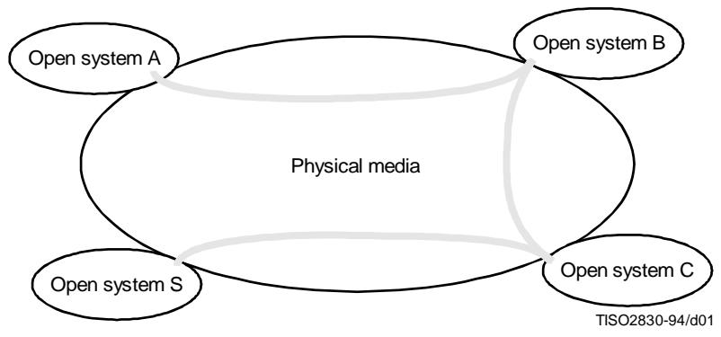

Figure 1 - Open systems connected by physical media

4.2.9 OSI is concerned only with the interconnection of systems. All other aspects of systems which are not related to interconnection are outside the scope of OSI. 

4.2.10 OSI is concerned not only with the transfer of information between systems, i.e. transmission, but also with their capability to interwork to achieve a common (distributed) task. In other words, OSI is concerned with the interconnection aspects of cooperation1) between systems, which is implied by the expression "systems interconnection." 

4.2.11 The objective of OSI is to define a set of standards to enable real open systems to cooperate. A system which complies with the requirements of applicable OSI standards in its cooperation with other systems is termed a real open system. 

4.2.12 The design intent of the OSI standards is to specify a set of standards that make it possible for autonomous systems to communicate. Any equipment which communicates in conformance with all applicable OSI protocol standards is a real world equivalent of the model concept "open system". Equipment that is in the "terminal" category, that is, one that requires human intervention for the dominant parts of information processing, may satisfy the conditions of the previous sentences when the appropriate OSI standards are employed in communication with other open systems. 

# 4.3 Modelling the OSI Environment

4.3.1 The development of OSI standards, i.e. standards for the interconnection of real open systems, is assisted by the use of abstract models. To specify the external behavior of interconnected real open systems, each real open system is replaced by a functionally equivalent abstract model of a real open system called an open system. Only the interconnection aspects of these open systems would strictly need to be described. However to accomplish this, it is necessary to describe both the internal and external behavior of these open systems. Only the external behavior of open systems is retained for the definition of standards for real open systems. The description of the internal behavior of open systems is provided in the Basic Reference Model only to support the definition of the interconnection aspects. Any real system which behaves externally as an open system can be considered to be a real open system. 

4.3.2 This abstract modelling is used in two steps. 

4.3.3 First, basic elements of open systems and some key decisions concerning their organization and functioning, are developed. This constitutes the Basic Reference Model of Open Systems Interconnection described in this Recommendation | Part of this International Standard. 

4.3.4 Then, the detailed and precise description of the functioning of the open system is developed in the framework formed by the Basic Reference Model. This constitutes the services and protocols for OSI which are the subject of other Recommendations and/or International Standards. 

4.3.5 It should be emphasized that the Basic Reference Model does not, by itself, specify the detailed and precise functioning of the open system and, therefore, it does not specify the external behavior of real open systems and does not imply the structure of the implementation of a real open system. 

4.3.6 The reader not familiar with the technique of abstract modelling is cautioned that those concepts introduced in the description of open systems constitute an abstraction despite a similar appearance to concepts commonly found in real systems. Therefore, real open systems need not be implemented as described by the Model. 

4.3.7 Throughout the remainder of this Basic Reference Model, only the aspects of real systems and application-processes which lie within the OSI Environment (OSIE) are considered. Their interconnection is illustrated throughout this Reference Model as depicted in Figure 2. 

4.3.8 The extent of the application of the OSIE concept through the use of OSI standards may result in subsets of the OSIE which corresponds to partially disjoint sets of real open systems, which are not physically capable of OSI communication between them. 

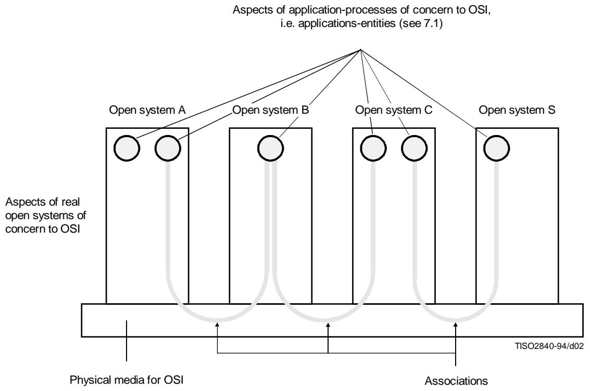

Figure 2 - Basic elements of OSI

# 5 Concepts of a layered architecture

# 5.1 Introduction

5.1.1 Clause 5 sets forth the architectural concepts that are applied in the development of the Reference Model of Open Systems Interconnection. Firstly, the concept of a layered architecture (with layers, entities, service-access-points, protocols, connections, etc.) is described. Secondly, identifiers are introduced for entities, service-access-points, and connections. Thirdly, service-access-points and data-units are described. Fourthly, elements of layer operation are described including connections, transmission of data, and error functions. Then, routing aspects are introduced and finally, management aspects are discussed. 

5.1.2 The concepts described in clause 5 are those required to describe the Reference Model of Open Systems Interconnection. However, not all of the concepts described are employed in each layer of the Reference Model. 

5.1.3 Four elements are basic to the Reference Model (see Figure 2): 

a) open systems; 

b) the application-entities which exist within the OSI Environment (see 7.1); 

c) the associations (see 5.3) which join the application-entities and permit them to exchange information; and 

d) the physical media for OSI. 

NOTE - Security aspects which are also general architectural elements of protocols are discussed in CCITT Rec. X.800 | ISO 7498-2. 

# 5.2 Principles of layering

# 5.2.1 Definitions

5.2.1.1 (N)-subsystem: An element in a hierarchical division of an open system which interacts directly only with elements in the next higher division or the next lower division of that open system. 

5.2.1.2 (N)-layer: A subdivision of the OSI architecture, constituted by subsystems of the same rank (N). 

5.2.1.3 peer-(N)-entities: Entities within the same (N)-layer. 

5.2.1.4 sublayer: A subdivision of a layer. 

5.2.1.5 (N)-service: A capability of the (N)-layer and the layers beneath it, which is provided to $(\mathrm{N} + 1)$ -entities at the boundary between the (N)-layer and the $(\mathrm{N} + 1)$ -layer. 

5.2.1.6 (N)-facility: A part of an (N)-service. 

5.2.1.7 (N)-function: A part of the activity of (N)-entities. 

5.2.1.8 (N)-service-access-point, (N)-SAP: The point at which (N)-services are provided by an (N)-entity to an $(\mathbf{N} + 1)$ -entity. 

5.2.1.9 (N)-protocol: A set of rules and formats (semantic and syntactic) which determines the communication behavior of (N)-entities in the performance of (N)-functions. 

5.2.1.10 (N)-entity-type: A description of a class of (N)-entities in terms of a set of capabilities defined for the (N)-layer. 

5.2.1.11 (N)-entity: An active element within an (N)-subsystem embodying a set of capabilities defined for the (N)-layer that corresponds to a specific (N)-entity-type (without any extra capabilities being used). 

5.2.1.12 (N)-entity-invoice: A specific utilization of part or all of the capabilities of a given (N)-entity (without any extra capabilities being used). 

# 5.2.2 Description

5.2.2.1 The basic structuring technique in the Reference Model of Open Systems Interconnection is layering. According to this technique, each open system is viewed as logically composed of an ordered set of (N)-subsystems, represented for convenience in the vertical sequence shown in Figure 3. Adjacent (N)-subsystems communicate through their common boundary. (N)-subsystems of the same rank (N) collectively form the (N)-layer of the Reference Model of Open Systems Interconnection. There is one and only one (N)-subsystem in an open system for layer N. An (N)-subsystem consists of one or several (N)-entities. Entities exist in each (N)-layer. Entities in the same (N)-layer are termed peer-(N)-entities. Note that the highest layer does not have an $(\mathrm{N} + 1)$ -layer above it and the lowest layer does not have an (N-1)-layer below it. 

5.2.2.2 Not all peer-(N)-entities need or even can communicate. There may be conditions which prevent this communication (for example: they are not in interconnected open systems, or they do not support the same protocol subsets). Communication among peer-(N)-entities which reside in the same (N)-subsystem is provided by the LSE and therefore is out of the scope of OSI. 

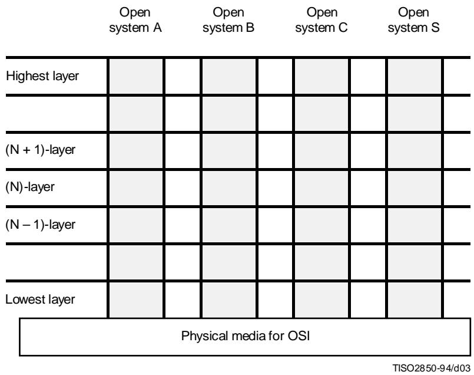

Figure 3 - Layering in cooperating open systems

# NOTES

1 The distinction between the type of some object and an instance of that object is a distinction of significance for OSI. A type is a description of a class of objects. An instance of this type is any object that conforms to this description. The instances of the same type constitute a class. A type, and any instances of this type can be referred to by an individual name. Each nameable instance and the type to which this instance belongs carry distinguishable names. 

For example, given that a programmer has written a computer program, that programmer has generated a type of something where instances of that type are created every time that particular program is invoked into execution by a computer. Thus, a FORTRAN compiler is a type and each occasion where a copy of that program is invoked in a data processing machine one displays an instance of that program. 

The general concept of instantiation applies within OSI: Consider now an (N)-entity in the OSI context. It too, has two aspects, a type and a collection of invocations. The type of an (N)-entity is defined by description of the specific set of (N)-layer functions it is able to perform. An invocation of that type of (N)-entity is a specific invocation of whatever it is within the relevant open system that provides the (N)-layer functions called for by its type for a particular occasion of communication. It follows from these observations that (N)-entities refer only to the properties of an association between peer (N)-entities, while an (N)-entity-invocation refers to the specific, dynamic occasions of actual information exchange. 

It is important to note that actual communication occurs only between (N)-entity-invocations at all layers. In the connection-mode (see 5.3.3), it is only at connection establishment time (or its logical equivalent during a recovery process) that (N)-entities are explicitly relevant. An actual connection is always made with a specific (N)-entity-invocation, although the request for connection is often made to an arbitrary (N)-entity (of a specific type). If an (N)-entity-invocation is aware of the name of its peer-(N)-entity-invocation, it is able to request another connection to that (N)-entity-invocation. 

It may be necessary to further divide a layer into small substructures called sublayers and to extend the technique of layering to cover other dimensions of OSI. A sublayer is defined as a grouping of functions in a layer which may be bypassed. The bypassing of all the sublayers of a layer is not allowed. A sublayer uses the entities and communication services of the layer. The detailed definition or additional characteristics of a sublayer are for further study. 

5.2.2.3 Except for the highest layer, each (N)-layer provides $(\mathrm{N} + 1)$ -entities in the $(\mathrm{N} + 1)$ -layer with an (N)-service at (N)-SAP(s). The properties of (N)-SAPs are described in 5.5. The highest layer is assumed to represent all possible uses of the (N)-service which are provided by the lower layers. 

NOTE - Not all open systems provide the initial source or final destination of data. Such open systems need not contain the higher layers of the architecture (see Figure 12). 

5.2.2.4 Each service provided by an (N)-layer may be tailored by the selection of one or more (N)-facilities which determine the attributes of that service. When a single (N)-entity cannot by itself fully support a service requested by an $(\mathrm{N} + 1)$ -entity it calls upon the co-operation of other (N)-entities to help complete the service request. In order to co-operate, (N)-entities in any layer, other than those in the lowest layer, communicate by means of the set of services provided by the (N-1)-layer (see Figure 4). The entities in the lowest layer are assumed to communicate directly via the physical media which connect them. 

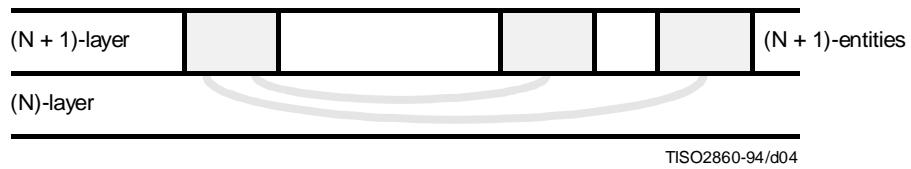

Figure 4 - $(\mathbf{N} + \mathbf{1})$ -entities in the $(\mathbf{N} + \mathbf{1})$ -layer communicate through the (N)-layer

5.2.2.5 The services of an (N)-layer are provided to the $(\mathrm{N} + 1)$ -layer using the (N)-functions performed within the (N)-layer and as necessary the services available from the (N-1)-layer. 

NOTE - This does not preclude the case where no protocol action is required in the (N)-layer to support a given (N)-facility because it is already available at the (N-1)-service boundary. However, null functionality of the complete (N)-protocol is not allowed. 

5.2.2.6 An (N)-entity may provide services to one or more $(\mathrm{N} + 1)$ -entities and use the services of one or more (N-1)-entities. An (N)-service-access-point is the point at which a pair of entities in adjacent layers use or provide services (see Figure 7). 

5.2.2.7 Cooperation between (N)-entities is governed by one or more (N)-protocols. The entities and protocols within a layer are illustrated in Figure 5. 

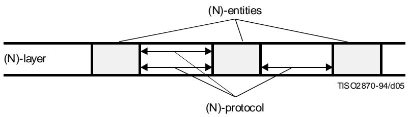

Figure 5 - (N)-protocols between (N)-entities

# 5.3 Communication between peer-entities

# 5.3.1 Definitions

5.3.1.1 (N)-association: A cooperative relationship among (N)-entity-invocations. 

5.3.1.2 (N)-connection: An association requested by an $(\mathrm{N} + 1)$ -entity for the transfer of data between two or more $(\mathrm{N} + 1)$ -entities. The association is established by the (N)-layer and provides explicit identification of a set of (N)-data-transmissions and agreement concerning the (N)-data-transmission services to be provided for the set. 

5.3.1.3 (N)-connection-endpoint: A terminator at one end of an (N)-connection within an (N)-service-access-point. 

5.3.1.4 multi-endpoint-connection: A connection with more than two connection-endpoints. 

5.3.1.5 correspondent (N)-entities: (N)-entities with an (N-1)-connection between them. 

5.3.1.6 (N)-relay: An (N)-function by means of which an (N)-entity forwards data received from one peer-(N)-entity to another peer-(N)-entity. 

5.3.1.7 (N)-data-source: An (N)-entity that sends (N-1)-service-data-units (see 5.6.1.7) on an (N-1)-connection. $^{2)}$ 

5.3.1.8 (N)-data-sink: An (N)-entity that receives (N-1)-service-data-units on an (N-1)-connection $^{2)}$ 

5.3.1.9 (N)-data-transmission: An (N)-facility which conveys (N)-service-data-units from one $(\mathrm{N} + 1)$ -entity to one or more $(\mathrm{N} + 1)$ -entities. 

5.3.1.10 (N)-duplex-transmission: (N)-data-transmission in both directions at the same time.2) 

5.3.1.11 (N)-half-duplex-transmission: (N)-data-transmission in either direction, one direction at a time; the choice of direction is controlled by an $(\mathrm{N} + 1)$ -entity.2) 

5.3.1.12 (N)-simplex-transmission: (N)-data-transmission in one pre-assigned direction.2) 

5.3.1.13 (N)-data-communication: An (N)-function which transfers (N)-protocol-data-units (see 5.6.1.3) according to an (N)-protocol, over one or more (N-1)-connections. $^{2)}$ 

5.3.1.14 (N)-two-way-simultaneous-communication: (N)-data-communication in both directions at the same time. 

5.3.1.15 (N)-two-way-alternate-communication: (N)-data-communication in both directions, one direction at a time. 

5.3.1.16 (N)-one-way-communication: (N)-data-communication in one pre-assigned direction. 

5.3.1.17 (N)-connection-mode transmission: (N)-data-transmission in the context of an (N)-connection. 

5.3.1.18 (N)-connectionless-mode transmission: (N)-data-transmission not in the context of an (N)-connection and not required to maintain any logical relationship between (N)-service-data-units. 

# 5.3.2 Description

5.3.2.1 For information to be exchanged between two or more $(\mathrm{N} + 1)$ -entities, an association is established between them in the (N)-layer using an (N)-protocol. 

NOTE - Classes of protocols may be defined within the (N)-protocols. 

5.3.2.2 The rules and formats of an (N)-protocol are instantiated in an (N)-subsystem by an (N)-entity. An (N)-entity may support one or more (N)-protocols. (N)-entities may support (N)-protocols which are connection-mode or connectionless-mode or both. (N)-entities when supporting connection-mode maintain the binding of (N)-connections to the appropriate $(\mathrm{N} + 1)$ -entities at the appropriate (N)-SAPs. (N)-entities when supporting connectionless-mode maintain a binding with the appropriate (N)-SAPs for delivering the connectionless data to the $(\mathrm{N} + 1)$ -entities. 

5.3.2.3 $(\mathrm{N} + 1)$ -entities can communicate only by using the services of the (N)-layer. There are instances where services provided by the (N)-layer do not permit direct access between all of the $(\mathrm{N} + 1)$ -entities which have to communicate. If this is the case communication can still occur if some other $(\mathrm{N} + 1)$ -entities can act as relays between them (see Figure 6). 

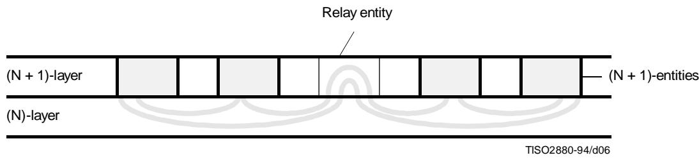

Figure 6 - Communication through a relay

5.3.2.4 The fact that communication is relayed by a chain of $(\mathrm{N} + 1)$ -entities is known neither by the (N)-layer nor by the $(\mathrm{N} + 2)$ -layer. 

# 5.3.3 Modes of communication

# 5.3.3.1 Introduction

5.3.3.1.1 An (N)-layer may offer a connection-mode service, a connectionless-mode service, or both, to the $(\mathrm{N} + 1)$ -layer, using the service or services provided by the (N-1)-layer. Any instance of transmission between the $(\mathrm{N} + 1)$ -entities must utilize the same mode of (N)-service. 

5.3.3.1.2 Both the (N)-connection-mode service and the (N)-connectionless-mode service are characterised by the facilities which they offer to, and the quality of service seen by, the $(\mathrm{N} + 1)$ -entities. For both the (N)-connection-mode service and the (N)-connectionless-mode service, functions may be provided by the (N)-layer to enhance the facilities offered to, and the quality of service seen by the $(\mathrm{N} + 1)$ -entities over those which are offered to the (N)-layer by the (N-1)-layer and, if necessary, to convert between one mode of service and another. 

5.3.3.1.3 Since connection-mode transmission and connectionless-mode transmission are complementary concepts, they are best understood in juxtaposition, particularly since connectionless-mode transmission is defined most easily in relationship to the concept of a connection. 

5.3.3.1.4 In order for $(\mathrm{N} + 1)$ -entities to be able to communicate using an (N)-connection-mode service or an (N)-onnectionless-mode service it is essential that a pre-arranged association exists between them, constituted by the pre-knowledge which it is essential that each $(\mathrm{N} + 1)$ -entity has of the others in order at least to initiate the use of the service. This association is established in ways which are not detailed in this Basic Reference Model and comprises four elements: 

a) knowledge of the addresses of the peer-(N)-entities involved; 

b) knowledge of a protocol agreed by the peer-(N)-entities for use at least to initiate communication; 

c) knowledge of the availability for communication of the peer-(N)-entities; 

d) knowledge of the quality of service available from the (N)-service. 

NOTE - The pre-knowledge constituting a pre-arranged association can be acquired in many ways; some examples are listed below: 

a) from information acquired manually when contracts are exchanged with a service provider; 

b) from information which a network administration may provide in a directory or enquiry database; 

c) from information that may be learned from previous instances of communication; 

d) from information that may be provided dynamically through the operation of management protocols. 

The total pre-knowledge constituting a pre-arranged association is likely to be acquired in a combination of the above ways. 

# 5.3.3.2 Connection mode

5.3.3.2.1 A connection is an association established for the transfer of data between two or more peer-(N)-entities. This association binds the peer-(N)-entities together with the (N-1)-entities in the next lower layer. The ability to establish and release a connection and to transfer data over it is provided to the (N)-entities in a given (N)-layer by the next lower layer as a connection-mode service. The use of a connection-mode service by peer-(N)-entities proceeds through three distinct phases: 

a) connection establishment; 

b) data transfer; and 

c) connection release. 

5.3.3.2.2 In addition to the clearly distinguishable lifetime exhibited by these phases, a connection has the following fundamental characteristics: 

a) it involves establishing and maintaining a two or more party agreement concerning the transmission of data among the peer-(N)-entities concerned, and using the provider of the (N-1)-service; 

b) it allows the negotiation between all the parties concerned of the parameters and options that will govern the transmission of data; 

c) it provides connection identification by means of which the overheads involved in address resolution and transmission can be avoided on data transfers; 

d) it provides a context within which successive units of data transmitted between the peer-entities are logically related, and makes it possible to maintain sequence and provide flow control for those transmissions. 

5.3.3.2.3 The characteristics of connection-mode transmission are particularly attractive in applications which call for relatively long-lived, stream-oriented interactions between entities in stable configurations. Examples are provided by direct terminal use of a remote computer, file transfer, and long-term attachment of remote job entry stations. In these cases, the entities involved initially discuss their requirements and agree to the terms of their interaction, reserving whatever resources they may need, transfer a series of related units of data to accomplish their mutual objective, and explicitly end their interaction, releasing the previously reserved resources. The properties of connection-mode transmission are also relevant in a wide range of other applications. 

5.3.3.2.4 Connection-mode transmission is accomplished through the use of (N)-connections. (N)-connections are provided by the (N)-layer between two or more (N)-service-access-points. The terminator of an (N)-connection at an (N)-service-access-point is called an (N)-connection-endpoint. An (N)-connection is provided by the (N)-layer between two or more (N)-service-access-points at the request of a calling $(\mathrm{N} + 1)$ -entity in support of the $(\mathrm{N} + 1)$ -entities attached to the (N)-service-access-points involved in the (N)-connection. An (N)-connection with more than two endpoints is termed a multi-endpoint-connection. (N)-entities with a connection between them are termed correspondent (N)-entities. 

NOTE - Data transfer using an (N)-connection-mode service involves the establishment of an (N)-connection prior to the data transfer. This dynamically sets up an association between the $(\mathrm{N} + 1)$ -entities and the (N)-connection-mode service in addition to the association identified in 5.3.2. This association involves elements which are not part of the pre-arranged association described in 5.3.3.1.4, in particular: 

a) knowledge of the willingness of the peer-(N)-entity or entities to undertake a specific communication, and of the willingness of the underlying service to support it and; 

b) the ability for the peer-(N)-entities to negotiate and renegotiate the characteristics of the communication. 

# 5.3.3.3 Connectionless mode

5.3.3.3.1 Connectionless-mode transmission is the transmission of a single unit of data from a source service-access-point to one or more destination service-access-points without establishing a connection. A connectionless-mode service allows an entity to initiate such a transmission by the performance of a single service access. 

5.3.3.3.2 In contrast to a connection, an instance of the use of a connectionless-mode service does not have a clearly distinguishable lifetime. In addition, t has the following fundamental characteristics: 

a) it requires only a pre-arranged association between the peer-(N)-entities involved which determines the characteristics of the data to be transmitted, and no dynamic agreement is involved in an instance of the use of the service; 

b) all the information required to deliver a unit of data - destination address, quality of service selection, options, etc. - is presented to the layer providing the connectionless-mode service, together with the unit of data to be transmitted, in a single service access. The layer providing the connectionless-mode service is not required to relate this access to any other access. 

5.3.3.3.3 As a result of these fundamental characteristics it may also be true that: 

a) each unit of data transmitted is routed independently by the layer providing the connectionless-mode service; and 

b) copies of a unit of data can be transmitted to a number of destination addresses. 

5.3.3.3.4 These characteristics of connectionless-mode transmission do not preclude making available to the service user information on the nature and quality of service which may apply for a single invocation of the service or which may be observed over successive invocations of the service between pairs of (N)-service-access-points or among a set of (N)-service-access-points. 

5.3.3.3.5 For each layer, the subclauses of clause 7 identify those items which have relevance to the connectionless-mode service provided by that layer. 

5.3.3.3.6 The basic (N)-connectionless-mode service is a service which meets the following conditions: 

a) it is not required to exhibit any minimum values of the quality of service measures, in particular the sequence of (N)-service-data-units need not be maintained and; 

b) it is not required to exhibit peer flow control. 

5.3.3.3.7 Any (N)-connectionless-mode service definition should allow the basic service. 

5.3.3.3.8 Since the basic service is not required to maintain the sequence of (N)-service-data-units, there is no requirement for any (N)-layer to provide sequencing functions. However, in real implementations the characteristics of the underlying medium or of real subnetworks may offer a high probability of in-sequence delivery and this may be reflected in the characteristics of the connectionless-mode services offered by higher layers. 

5.3.3.3.9 An $(\mathrm{N} + 1)$ -entity provides no information to the provider of an (N)-connectionless-mode service about the logical relationships between (N)-service-data-units, apart from the source and destination (N)-service-access-point-addresses. 

5.3.3.3.10 From the point of view of the $(\mathrm{N} + 1)$ -entity this means that it is not able to require the (N)-service to apply a particular function to a sequence of (N)-service-data-units sent by it. However, from the point of view of the (N)-layer, this does not imply any constraint on the functions which support the service. 

5.3.3.3.11 $(\mathrm{N} + 1)$ -entities can communicate using an (N)-connectionless-mode service provided that there is a prearranged association between them providing knowledge about each other which allows them to do so. This knowledge should allow the locations of the $(\mathrm{N} + 1)$ -entities to be determined, it should determine the correct interpretation of (N)-service-data-units by a receiving $(\mathrm{N} + 1)$ -entity, and it may define the rates of transfer, rates of response, and the protocol in use between the entities. The knowledge may result from prior agreement between the $(\mathrm{N} + 1)$ -entities concerning the parameters, formats, and options to be used. 

5.3.3.3.12 $(\mathrm{N} + 1)$ -entities may require prior knowledge of the facilities offered by the service and the quality of service which they can expect to receive from it in order to choose an $(\mathrm{N} + 1)$ -protocol to be used for communication over an (N)-connectionless-mode service. 

# 5.3.4 The relationship between services provided at adjacent layer boundaries

5.3.4.1 There are no architectural constraints on any vertical combination of an (N)-layer providing one type of (N)-service (connection-mode or connectionless-mode) using the other type of (N-1)-service. In principle the services at the two layer boundaries can be: 

a) both connection-mode services; 

b) both connectionless-mode services; 

c) the (N)-service a connection-mode service and the (N-1)-service a connectionless-mode service; 

d) the (N)-service a connectionless-mode service and the (N-1)-service a connection-mode service. 

5.3.4.2 In order to allow combinations c) and d) two architectural elements are required: 

a) a function to provide an (N)-connection-mode service using an (N-1)-connectionless-mode service; and 

b) a function to provide an (N)-connectionless-mode service using an (N-1)-connection-mode service. 

These are known as mode conversion functions. 

NOTE - Of these functions, function a) requires significant protocol-control-information. For example, there is a need to identify the connection which is constructed, control its state and provide sequencing of service-data-units. Function b) requires little or no additional protocol-control-information, rather, it places constraints on the way in which the connection-mode service is used. 

# 5.3.5 Application of mode conversion functions

5.3.5.1 Mode conversion functions may be invoked in OSI end systems, or in OSI relay systems (see 6.5). When invoked in OSI relay systems, the mode conversion functions may either: 

a) join an (N)-protocol using the (N-1)-connectionless service and an (N)-protocol using the (N-1)-connection-mode service in support of an (N)-connection-mode service; or 

b) join an (N)-protocol using the (N-1)-connectionless-mode service and an (N)-protocol using the (N-1)-connection-mode service in support of an (N)-connectionless mode service. 

5.3.5.2 The use of mode conversions between (N-1)-services within a layer is not explicitly constrained by the Reference Model but, where several (N-1)-services are connected in tandem, the use of mode conversions would be ordered to minimize the number of mode conversions necessary to arrive at a given composite (N)-service. 

5.3.5.3 Where an (N-1)-connectionless-mode service is enhanced to provide a (N)-connection-mode service, a number of (N)-connections may be supported by (N-1)-connectionless-mode transmission between the same (N-1)-service-access-points. 

5.3.5.4 Where an (N-1)-connection-mode service is used to provide an (N)-connectionless-mode service, (N)-connectionless-mode transmission between a number of different (N)-service-access-points may be supported by the same (N-1)-connection. 

# 5.4 Identifiers

# 5.4.1 Definitions

5.4.1.1 (N)-address: A name unambiguous within the OSIE which is used to identify a set of (N)-service-access-points which are all located at a boundary between an (N)-subsystem and an $(\mathrm{N} + 1)$ -subsystem in the same open system. 

NOTE - A name is unambiguous within a given scope when it identifies one and only one object within that scope. Unambiguity of a name does not preclude the existence of synonyms. 

5.4.1.2 (N)-service-access-point-address; (N)-SAP-address: An (N)-address that is used to identify a single (N)-SAP. 

5.4.1.3 (N)-address-mapping: An (N)-function which provides the mapping between the (N)-addresses and the (N- 1)-addresses associated with an (N)-entity. 

5.4.1.4 routing: A function within a layer which translates the title of an entity or the service-access-point-address to which the entity is attached into a path by which the entity can be reached. 

5.4.1.5 (N)-connection-endpoint-identifier: An identifier of an (N)-connection-endpoint which can be used to identify the corresponding (N)-connection at an (N)-service-access-point. 

5.4.1.6 (N)-connection-endpoint-suffix: A part of an (N)-connection-endpoint-identifier which is unique within the scope of an (N)-service-access-point. 

5.4.1.7 multi-connection-endpoint-identifier: An identifier which specifies the connection-endpoint of a multi-endpoint-connection which should accept the data that is being transferred. 

5.4.1.8 (N)-service-connection-identifier: An identifier which uniquely specifies an (N)-connection within the environment of the correspondent $(\mathrm{N} + 1)$ -entities. 

5.4.1.9 (N)-protocol-connection-identifier: An identifier which uniquely specifies an individual (N)-connection within the environment of the multiplexed (N-1)-connection. 

5.4.1.10 (N)-entity-title: A name that is used to identify unambiguously an (N)-entity. 

# 5.4.2 Description

5.4.2.1 An (N)-service-access-point-address identifies a particular (N)-service-access-point to which an $(\mathrm{N} + 1)$ -entity is attached (see Figure 7). When the $(\mathrm{N} + 1)$ -entity is detached from the (N)-service-access-point, the (N)-SAP-address no longer provides access to the $(\mathrm{N} + 1)$ -entity. If the (N)-service-access-point is reattached to a different $(\mathrm{N} + 1)$ -entity, then the (N)-SAP-address identifies the new $(\mathrm{N} + 1)$ -entity and not the old one. 

5.4.2.2 The use of an (N)-SAP-address to identify an $(\mathrm{N} + 1)$ -entity is the most efficient mechanism if the permanence of attachment between the $(\mathrm{N} + 1)$ -entity and the (N)-service-access-point can be assured. 

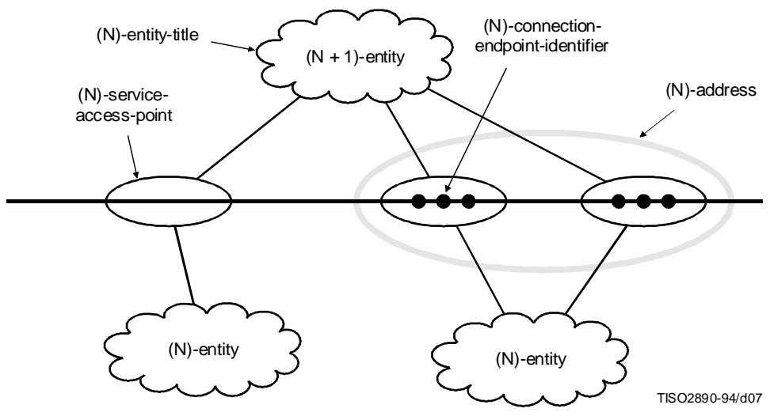

Figure 7 - Entities, service-access-points and identifiers

5.4.2.3 Interpretation of the correspondence between the (N)-addresses served by an (N)-entity and the (N-1)-addresses used for accessing (N-1)-services is performed by an (N)-address-mapping function. 

5.4.2.4 The structure of an (N)-address is known by the (N)-entity which is attached to the identified (N)-service-access-point. However, the $(\mathrm{N} + 1)$ -entity does not know this structure. 

5.4.2.5 If an $(\mathrm{N} + 1)$ -entity has two or more (N)-service-access-points with either the same (N)-entity or different (N)-entities, the (N)-entities have no knowledge of this fact. Each (N)-service-access-point is considered to identify a different $(\mathrm{N} + 1)$ -entity from the perspective of the (N)-entities. 

5.4.2.6 A routing function translates the (N)-address of an $(\mathrm{N} + 1)$ -entity into a path or route by which the $(\mathrm{N} + 1)$ -entity may be reached. 

5.4.2.7 An $(\mathrm{N} + 1)$ -entity may establish an (N)-connection with another $(\mathrm{N} + 1)$ -entity by using an (N)-service. When an $(\mathrm{N} + 1)$ -entity establishes an (N)-connection with another $(\mathrm{N} + 1)$ -entity, each $(\mathrm{N} + 1)$ -entity is given an (N)-connection-endpoint-identifier by its supporting (N)-entity. The $(\mathrm{N} + 1)$ -entity can then distinguish the new connection from all other (N)-connections accessible at the (N)-service-access-point it is using. This (N)-connection-endpoint-identifier is unique within the scope of the $(\mathrm{N} + 1)$ -entity which will use the (N)-connection. 

5.4.2.8 The (N)-connection-endpoint-identifier consists of two parts: 

a) the (N)-SAP-address of the (N)-service-access-point which will be used in conjunction with the (N)-connection; and 

b) an (N)-connection-endpoint-suffix which is unique within the scope of the (N)-service-access-point. 

5.4.2.9 A multi-endpoint-connection requires multi-connection-endpoint-identifiers. Each such identifier is used to specify which connection-endpoint should accept the data which is being transferred. A multi-connection-endpoint-identifier is unique within the scope of the connection within which it is used. 

5.4.2.10 The (N)-layer may provide to the $(\mathrm{N} + 1)$ -entities an (N)-service-connection-identifier which uniquely specifies the (N)-connection within the environment of the correspondent $(\mathrm{N} + 1)$ -entities. 

# 5.5 Properties of service-access-points

5.5.1 An $(\mathbf{N} + 1)$ -entity requests (N)-service via an (N)-service-access-point which permits the $(\mathbf{N} + 1)$ -entity to interact with an (N)-entity. 

5.5.2 Both the (N)- and $(\mathbf{N} + 1)$ -entities attached to an (N)-service-access-point are in the same system. 

5.5.3 An $(\mathbf{N} + 1)$ -entity may concurrently be attached to one or more (N)-service-access-points attached to the same or different (N)-entities. 

5.5.4 An (N)-entity may concurrently be attached to one or more $(\mathrm{N} + 1)$ -entities through (N)-service-access-points. 

5.5.5 An (N)-service-access-point is attached to only one (N)-entity and to only one $(\mathrm{N} + 1)$ -entity at a time. 

5.5.6 An (N)-service-access-point may be detached from an $(\mathbf{N} + 1)$ -entity and reattached to the same or another $(\mathbf{N} + 1)$ -entity. 

5.5.7 An (N)-service-access-point may be detached from an (N)-entity and reattached to the same or another (N)-entity. 

5.5.8 An (N)-service-access-point is located by means of its (N)-SAP-address. An (N)-SAP-address is used by an $(\mathbf{N} + 1)$ -entity to request an instance of communication. 

5.5.9 An (N)-service-access-point may support: 

a) (N)-connection-mode service only; 

b) (N)-connectionless-mode service only; 

c) (N)-connection-mode services and (N)-connectionless-mode services concurrently. 

5.5.10 A single $(\mathrm{N} + 1)$ -entity may concurrently be using several (N)-connections and an (N)-connectionless-mode service through one or more (N)-service-access-points to which it is attached. 

5.5.11 $(\mathrm{N} + 1)$ -entities distinguish between instances of the (N)-connectionless-mode services and the (N)-connection-mode services offered concurrently through the same (N)-service-access-point by the uniqueness of the interactions prescribed for these services. 

# 5.6 Data-units

# 5.6.1 Definitions

5.6.1.1 (N)-protocol-control information: Information exchanged between (N)-entities to co-ordinate their joint operation. 

5.6.1.2 (N)-user-data: The data transferred between (N)-entities on behalf of the $(\mathbf{N} + 1)$ -entities for whom the (N)-entities are providing services. 

5.6.1.3 (N)-protocol-data-unit: A unit of data specified in an (N)-protocol and consisting of (N)-protocol-control-information and possibly (N)-user-data. 

5.6.1.4 (N)-service-data-unit: An amount of information whose identity is preserved when transferred between peer-(N+1)-entities and which is not interpreted by the supporting (N)-entities. 

5.6.1.5 expedited (N)-service-data-unit. (N)-exploited-data-unit: A small (N)-service-data-unit whose transfer is expedited. The (N)-layer ensures that an expedited-data-unit will not be delivered after any subsequent service-data-unit or expedited unit sent on that connection. 

# 5.6.2 Description

5.6.2.1 Information is transferred in various types of data-units between peer-(N)-entities. The data-units are defined in 5.6 and the relationships among them are illustrated in Figures 8 and 9. 

<table><tr><td></td><td>Control</td><td>Data</td><td>Combined</td></tr><tr><td>(N)-(N)-peer-entities</td><td>(N)-protocol-control-information</td><td>(N)-user-data</td><td>(N)-protocol-data-unit</td></tr></table>

Figure 8 - Relationships among data-units

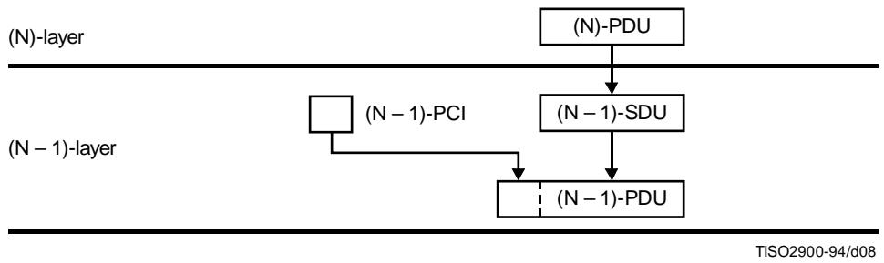

PCI Protocol-control-information 

PDU Protocol-data-unit 

SDU Service-data-unit 

# NOTES

1 This figure assumes that neither segmenting nor blocking of (N)-service-data-units is performed (see 5.8.1.9 and 5.8.1.11). 

2 This figure does not imply any positional relationship between protocol-control-information and user-data in protocol-data-unit. 

3 An (N)-protocol-data-unit may be mapped one-to-one into an $(\mathbf{N} - 1)$ -service-data-unit, but other relationships are possible. 

Figure 9 - An illustration of mapping between data-units in adjacent layers

5.6.2.2 Except for the relationships defined in Figures 8 and 9, there is no overall architectural limit to the size of data-units. There may be other size limitations at specific layers. 

5.6.2.3 Data may be held within a connection until a complete service-data-unit is put into the connection. 

# 5.7 The nature of the (N)-service

5.7.1 An (N)-service does not necessarily place bounds on the size of (N)-SDUs. The specification of the (N)-protocol, however, may place specific bounds on the size of (N)-PDUs. Blocking, segmenting, and concatenation are used to reconcile differences in the sizes of SDUs and corresponding PDUs. 

# 5.8 Elements of layer operation

# 5.8.1 Definitions

5.8.1.1 (N)-protocol-identifier: An identifier used between correspondent (N)-entities to select a specific (N)-protocol. 

5.8.1.2 centralized multi-endpoint-connection: A multi-endpoint-connection where data sent by the entity associated with the central connection-endpoint is received by all other entities, while data sent by one of the other entities is only received by the central entity. 

5.8.1.3 decentralized multi-endpoint-connection: A multi-endpoint-connection where data sent by an entity associated with a connection-endpoint is received by all other entities. 

5.8.1.4 multiplexing: A function performed by an (N)-entity in which one (N-1)-connection is used to support more than one (N)-connection. 

NOTE - The term multiplexing is also used in a more restricted sense to refer to the function performed by the sending (N)-entity while the term demultiplexing is used to refer to the function performed by the receiving (N)-entity. 

5.8.1.5 demultiplexing: A function performed by an (N)-entity which identifies (N)-protocol-data-units for more than one (N)-connection within an (N-1)-connection. It is the reverse function of the multiplexing function performed by the (N)-entity sending the (N-1)-service-data-units. 

5.8.1.6 splitting: A function within the (N)-layer by which more than one (N-1)-connection is used to support one (N)-connection. 

NOTE - The term splitting is also used in a more restrictive sense to refer to the function performed by the sending (N)-entity while the term recombining is used to refer to the function performed by the receiving (N)-entity. 

5.8.1.7 recombining: The function performed by an (N)-entity which identifies (N)-protocol-data-units for a single (N)-connection in (N-1)-service-data-units received on more than one (N-1)-connection. It is the reverse function of the splitting function performed by the (N)-entity sending the (N-1)-service-data-units. 

5.8.1.8 flow control: A function which controls the flow of data within a layer or between adjacent layers. 

5.8.1.9 segmenting: A function performed by an (N)-entity to map one (N)-service-data-unit into multiple (N)-protocol-data-units. 

5.8.1.10 reassembling: A function performed by an (N)-entity to map multiple (N)-protocol-data-units into one (N)-service-data-unit. It is the reverse function of segmenting. 

5.8.1.11 blocking: A function performed by an (N)-entity to map multiple (N)-service-data-units into one (N)-protocol-data-unit. 

5.8.1.12 deblocking: A function performed by an (N)-entity to identify multiple (N)-service-data-units which are contained in one (N)-protocol-data-unit. It is the reverse function of blocking. 

5.8.1.13 concatenation: A function performed by an (N)-entity to map multiple (N)-protocol-data-units into one (N-1)-service-data-unit. 

NOTE - Blocking and concatenation though similar (they both permit grouping of data-units) may serve different purposes. For instance, concatenation permits the (N)-layer to group one or several acknowledgement (N)-PDUs with one (or several) (N)-PDUs containing user-data. This would not be possible with the blocking function only. Note also that the two functions may be combined so that the (N)-layer performs blocking and concatenation. 

5.8.1.14 separation: A function performed by an (N)-entity to identify multiple (N)-protocol-data-units which are contained in one (N-1)-service-data-unit. It is the reverse function of concatenation. 

5.8.1.15 sequencing: A function performed by the (N)-layer to preserve the order of (N)-service-data-units that were submitted to the (N)-layer. 

5.8.1.16 acknowledgement: A function of the (N)-layer which allows a receiving (N)-entity to inform a sending (N)-entity of the receipt of an (N)-protocol-data-unit. 

5.8.1.17 reset: A function which sets the corresponding (N)-entities to a predefined state with a possible loss or duplication of data. 

5.8.1.18 (N)-protocol-version-identifier: An identifier conveyed between correspondent (N)-entities which allows the selection of the version of an (N)-protocol. 

NOTE - The definition of a new (N)-protocol-version-identifier presupposes a minimal common knowledge of the (N)-protocol identified by the preceding (N)-protocol-version-identifier. When such a minimal common knowledge cannot be achieved, the (N)-protocols are considered to be independent and different. 

# 5.8.2 Protocol selection and identification

5.8.2.1 Protocol identification is the process of determining the type of protocol being used. 

5.8.2.2 One or more (N)-protocols may be defined for the (N)-layer. An (N)-entity may employ one or more (N)-protocols. 

5.8.2.3 Meaningful communication between (N)-entities requires the agreed selection of one (N)-protocol. 

5.8.2.4 (N)-protocol-identifiers name the specific protocols defined. An $(\mathrm{N} + 1)$ -protocol-identifier cannot be part of (N)-PCI. Thus, an (N)-service uses (N)-addresses to identify an $(\mathrm{N} + 1)$ -protocol, as described in Rec. X.650 | ISO 7498-3. 

5.8.2.5 Since not all protocols (either OSI or non-OSI) can be assumed to carry an (N)-protocol-identifier, an (N)-protocol-identifier cannot be used to distinguish OSI and non-OSI protocols. The proper mechanism to use in these situations is an (N)-address. 

# 5.8.3 Protocol version selection and identification

# 5.8.3.1 Protocol version identification

5.8.3.1.1 Protocol version identification is a mechanism to identify the level of a particular protocol being used. The identification of the protocol version presupposes that the protocol itself has been identified either implicitly or by use of approved mechanisms. 

5.8.3.1.2 It may be convenient, in many cases, to recognize a sub-version id to be carried in (N)-PCI along with the (N)-protocol-version-id. This allows keeping track of minor evolutions of a given protocol version (e.g. in order to determine the degree of integration of defect reports, etc.). The decision of whether or not to introduce such a subversion id is of the responsibility of specific (N)-layer standards. However, only the (N)-protocol-version-id, regardless of any additional subversion id, is taken into account in order to determine whether or not communication is possible between peer-(N)-entities. 

# 5.8.3.2 The need for a new protocol version

5.8.3.2.1 The need for a new protocol version arises from changes made in the protocol. These changes can be: 

1) addition of new functions (i.e. not defined in the existing protocol specifications); 

2) deletion of existing functions (i.e. which were defined in the existing protocol specifications); 

3) modification of existing functions; or 

4) substitution of an alternate way to provide existing functions. 

5.8.3.2.2 Changes made in a protocol will not always imply the need for a new protocol version (or for a new protocol). A new protocol version (or new protocol) becomes necessary when these changes lead to a significant functional modification which cannot be compatibly negotiated using the existing protocol specifications so that a real open system utilizing the newly specified protocol functions would not be able to communicate with a real open system utilizing the old specifications. 

5.8.3.2.3 In such cases, if the two sets of protocol functions share at least a common understanding of the protocol version identification mechanisms (e.g. conveying, encoding, negotiating protocol version identifiers), they are considered to be two different versions of the same protocol, otherwise they are considered to be two different protocols. 

# NOTES

It is important to note that significant functional modifications are not always coupled to changes to protocol elements exchanged between pair entities (e.g. modification of the behavior of an (N)-entity due to the introduction of transparent services). 

2 It should be noted that new protocol versions are not directly related to the administrative process of revising existing standards. Such a process may or may not lead to a new protocol version depending on the degree of modification which has taken place. 

# 5.8.3.3 Negotiation mechanisms

5.8.3.3.1 The negotiation of protocol version can only occur in connection-mode communication. An (N)-protocolversion-id field should be present in PDUs relevant to connection establishment. A mechanism for handling protocol version identification is to determine, by means of the (N)-protocol-version-id, which version should be invoked on a specific connection between the calling and called (N)-entities. 

5.8.3.3.2 A calling (N)-entity sends information of all supported versions to a called (N)-entity. The called (N)-entity examines whether or not there are any supported versions common to the calling and called (N)-entities. If there is more than one common version, the latest common version is selected. If there is no common version, the connection establishment request is refused. 

5.8.3.3.3 The sub-version id, when present, is not used in the negotiation mechanisms. 

5.8.3.3.4 In connectionless-mode protocols, no negotiation mechanism is provided. Identification of the protocol version is either implicit (e.g. a priori knowledge) or explicitly conveyed in the PDUs. 

# 5.8.4 Properties of connectionless-mode transmission

5.8.4.1 All the information required by an (N)-connectionless-mode service to deliver an (N)-service-data-unit (destination address, quality of service required, options, etc.) is presented to it with the (N)-service-data-unit in a single logical service access by the sending $(\mathrm{N} + 1)$ -entity. 

5.8.4.2 All information related to an (N)-service-data-unit, together with the (N)-service-data-unit itself, is received from the (N)-service in a single logical service access by the receiving $(\mathrm{N} + 1)$ -entity. 

5.8.4.3 To provide the (N)-connectionless-mode service, the (N)-layer performs functions as described in 5.3.3.3. These functions are supported by (N)-protocols. 

5.8.4.4 If an (N)-service-data-unit cannot be accepted by an $(\mathrm{N} + 1)$ -entity at the time of its arrival at an (N)-service-access-point, the $(\mathrm{N} + 1)$ -entity may apply service boundary flow control (see 5.8.8.4). This may result in the discarding of the (N)-service-data-unit by the (N)-service provider or, where flow control is provided, in the exercise of service boundary flow control at the sending (N)-service-access-point by the (N)-service provider. 

5.8.4.5 An (N)-connectionless-mode service may allow the transmission of copies of an (N)-service-data-unit to a number of destination (N)-service-access-points. (N)-service-data-units transmitted from a number of source (N)-service-access-points can be received at one destination (N)-service-access point. The (N)-layer does not assume any logical relationship between these (N)-service-data-units. 

5.8.4.6 No (N)-protocol-control-information is exchanged between (N)-entities concerning the mutual willingness of the $(\mathrm{N} + 1)$ -entities to exchange data using an (N)-connectionless-mode service. 

# NOTES

1 The specific interface mechanism employed by a particular implementation of a connectionless-mode service may involve more than one interface exchange to accomplish the single logical service access necessary to initiate a connectionless-mode transmission. However, this is a local implementation detail. 

2 The transmission of each (N)-service-data-unit by an (N)-connectionless-mode service should be entirely self-contained. All the addressing and other information required by the (N)-layer to deliver the (N)-service-data-unit to its destination should be included in the service access for each transmission. 

3 It is a basic characteristic of connectionless-mode service that no negotiation of the parameters for a transmission takes place at the time the service is accessed and no dynamic association is set up between the parties involved. However, considerable freedom of choice can be preserved by allowing most parameter values and options (such as transfer rate, acceptable error rate, etc.) to be specified at the time the service is accessed. In a given implementation, if the local (N)-subsystem determines immediately (from information available to it locally) that the requested transmission cannot be performed under the conditions specified, it may abort the transmission, returning an implementation specific error message. If the same determination is made later, after the service access has been completed, the transmission is abandoned, since the (N)-layer is assumed not to have the information necessary to take any other action. 

# 5.8.5 Properties of connection-mode transmission

5.8.5.1 An (N)-connection is an association established for communication between two or more $(\mathrm{N} + 1)$ -entities, identified by their (N)-addresses. An (N)-connection is offered as a service by the (N)-layer, so that information may be exchanged between the $(\mathrm{N} + 1)$ -entities. 

5.8.5.2 An $(\mathbf{N} + 1)$ -entity may have, simultaneously, one or more (N)-connections with other $(\mathbf{N} + 1)$ -entities, with any given $(\mathbf{N} + 1)$ -entity, and with itself. 

5.8.5.3 An (N)-connection is established by referencing, either explicitly or implicitly, an (N)-address for the source $(\mathrm{N} + 1)$ -entity and an (N)-address for each of one or more destination $(\mathrm{N} + 1)$ -entities. 

NOTE - The specific interface mechanism employed by a particular implementation of a connection-mode service may involve more than one interface exchange to accomplish the single logical service access necessary to initiate a connection-mode transmission. However, this is a local implementation detail. 

5.8.5.4 The source (N)-address and one or more of the destination (N)-addresses may be the same. One or more of the destination (N)-addresses may be the same while the source (N)-address is different. All may be different. 

5.8.5.5 One (N)-connection-endpoint is constructed for each (N)-SAP-address referenced explicitly or implicitly when an (N)-connection is established. 

5.8.5.6 An $(\mathbf{N} + 1)$ -entity accesses an (N)-connection via an (N)-service-access-point. 

5.8.5.7 An (N)-connection has two or more (N)-connection-endpoints. 

5.8.5.8 An (N)-connection-endpoint is not shared by $(\mathbf{N} + 1)$ -entities or (N)-connections. 

5.8.5.9 An (N)-connection-endpoint relates three elements: 

a) an $(\mathbf{N} + 1)$ -entity; 

b) an (N)-entity; and 

c) an (N)-connection. 

5.8.5.10 The (N)-entity and the $(\mathrm{N} + 1)$ -entity related by an (N)-connection-endpoint are those implied by the (N)-SAPaddress referenced when the (N)-connection is established. 

5.8.5.11 An (N)-connection-endpoint has an identifier, called an (N)-connection-endpoint-identifier, which is unique within the scope of the $(\mathbf{N} + 1)$ -entity which is bound to the (N)-connection-endpoint. 

5.8.5.12 An (N)-connection-endpoint-identifier is not the same as an (N)-SAP-address. 

5.8.5.13 An $(\mathbf{N} + 1)$ -entity references an (N)-connection, using its (N)-connection-endpoint-identifier. 

5.8.5.14 Multi-endpoint-connections are connections which have three or more connection-endpoints. Two types of multi-endpoint-connection are defined:3) 

a) centralized; and 

b) decentralized. 

5.8.5.15 A centralized multi-endpoint-connection has a central connection-endpoint. Data sent by the entity associated with the central connection-endpoint is received by the entities associated with all other connection-endpoints. The data sent by an entity associated with any other connection-endpoint is received by the entity associated with the central connection-endpoint. 

5.8.5.16 On a decentralized multi-endpoint-connection, data sent by an (N)-entity associated with any connection-endpoint is received by the (N)-entities associated with all of the other connection-endpoints. 

# 5.8.6 Connection establishment and release

# 5.8.6.1 Introduction

5.8.6.1.1 All (N)-connections require establishment and release procedures. These procedures 

- may be designed to send (N)-PCI on the same (N)-connection as (N)-user-data (sometimes called in-band); 

- may be designed to send (N)-PCI on a different (N)-connection than (N)-user-data (sometimes called out-of-band); or 

- may be a priori procedures. 

A priori procedures are not the concern of OSI. These procedures may or may not be standardized. In all of these cases, the basic properties of the procedures are the same. Equivalent information is exchanged to initialize and synchronize the state of the correspondent (N)-entities. OSI is only concerned with in-band and out-of-band establishment and release procedures which are standardized. 

Table 1 - Functions used in Modes of Communication

<table><tr><td>Reference (Subclause)</td><td>Function</td><td>Connection</td><td>Connectionless</td></tr><tr><td>5.8.6</td><td>Conn Estab. &amp; Rel</td><td>x</td><td></td></tr><tr><td>5.8.6.4</td><td>Suspend</td><td>x</td><td></td></tr><tr><td>5.8.6.5</td><td>Resume</td><td>x</td><td></td></tr><tr><td>5.8.7</td><td>Muxing &amp; Splitting</td><td>x</td><td>x</td></tr><tr><td>5.8.8.1</td><td>Normal Data Transfert</td><td>x</td><td>x</td></tr><tr><td>5.8.8.2</td><td>during Establishment</td><td>x</td><td></td></tr><tr><td>5.8.8.3</td><td>Flow Control</td><td>x</td><td>x</td></tr><tr><td>5.8.8.4</td><td>Expedited</td><td>x</td><td></td></tr><tr><td>5.8.8.5</td><td>Segmenting</td><td>x</td><td>x</td></tr><tr><td></td><td>Blocking</td><td>x</td><td></td></tr><tr><td></td><td>Concatenation</td><td>x</td><td>x</td></tr><tr><td>5.8.8.6</td><td>Sequencing</td><td>x</td><td>x</td></tr><tr><td>5.8.9.1</td><td>Acknowledgement</td><td>x</td><td>x</td></tr><tr><td>5.8.9.2</td><td>Error Detect &amp; Notif</td><td>x</td><td>x</td></tr><tr><td>5.8.9.3</td><td>Reset</td><td>x</td><td></td></tr><tr><td>5.9</td><td>Routing</td><td>x</td><td>x</td></tr><tr><td>5.10</td><td>Quality of Service</td><td>xx</td><td>x</td></tr></table>

5.8.6.1.2 OSI protocols, operating independently of a given set of instances of communication, may be employed to control the resources that are required to support those instances of communications. These protocols, which are often called "out-of-band", can be used, for example, in support of the establishment of (N)-connections. Information needed for the establishment of an (N)-connection may be conveyed, not only through the direct (normally called "in-band") (N)-protocol, but also as part of a different (N)-layer protocol, common to many instances of communications. 

5.8.6.1.3 Non-standard procedures can be allowed in a compatible manner without affecting the operation of the (N)-protocol or $(\mathrm{N} + 1)$ -protocol. These non-standard procedures should not affect addressing, quality of service, service primitives, OSI management, etc. 

5.8.6.1.4 Some (N)-protocols may provide for the combining of connection establishment and connection release protocol exchanges. 

# 5.8.6.2 Connection establishment

5.8.6.2.1 The establishment of an (N)-connection by peer-(N)-entities of an (N)-layer requires the following: 

a) the availability of an (N-1)-service between the supporting (N)-entities; and 

b) both (N)-entities be in a state in which they can execute the connection establishment protocol exchange. 

5.8.6.2.2 If it is not already available, an (N-1)-service has to be established by peer-(N-1)-entities of the (N-1)-layer. This requires, for the (N-1)-layer, the same conditions as described above for the (N)-layer. 

5.8.6.2.3 The same consideration applies downwards until either an available lower layer service or the physical medium for OSI is encountered. 

5.8.6.2.4 Depending upon the characteristics of the (N-1)-service and of the establishment protocol exchange, the establishment of an (N)-connection may or may not be done in conjunction with the establishment of the (N-1)-connection. 

5.8.6.2.5 The characteristics of the (N)-service with regard to the establishment of the (N)-connection vary depending upon whether or not (N)-user-data can be transferred by the connection establishment protocol exchange for each direction of the (N)-connection. 

5.8.6.2.6 Where (N)-user-data is transferred by the (N)-connection establishment protocol exchange, the $(\mathrm{N} + 1)$ -protocol may take advantage of this to allow an $(\mathrm{N} + 1)$ -connection to be established in conjunction with the establishment of the (N)-connection. This is termed "embedding of connection establishment". If embedding at all layers were to be permitted, then the length of the user-data parameter in a connection establishment PDU may have to be indefinite. 

5.8.6.2.7 At certain layers the complexity involved in providing arbitrarily long user data fields in connection establishment primitives at every layer may outweigh any savings that could be accomplished by embedding. 

5.8.6.2.8 Embedding between adjacent layers where there are multiplexing, re-use, or quality of service enhancement functions causes complexity and redundancy of mechanism. Such additional complexity and redundancy do not necessarily cancel out all of the potential advantages of embedding. It is the responsibility of a layer to decide when protocol elements should be passed in the connection request or in the first data request, provided that adequate protocols are defined which allow such a selection. 

5.8.6.2.9 If embedding is used, failure of a connection establishment will result in failure of the embedded connection establishments. 

# 5.8.6.3 Connection Release

5.8.6.3.1 The release of an (N)-connection is normally initiated by one of the $(\mathrm{N} + 1)$ -entities associated in it. 

5.8.6.3.2 The release of an (N)-connection may also be initiated by one of the (N)-entities supporting it as a result of an exception condition occurring in the (N)-layer or the layers below. 

5.8.6.3.3 Depending upon the conditions, release of an (N)-connection may result in the discarding of (N)-user-data. 

5.8.6.3.4 The orderly release of an (N)-connection requires either the availability of an (N-1)-connection, or a common reference to time (for example, time of failure of the (N-1)-connection and common time-out). In addition, it requires that both (N)-entities are in a state in which they can execute the connection release protocol exchange. It is important to note, however, that the release of an (N-1)-connection does not necessarily cause the release of the (N)-connection(s) which were using it; the (N-1)-connection can be re-established, or another (N-1)-connection substituted. 

NOTE - The common reference to time refers to the expiration of time with respect to, or relative to an instance of service. 

5.8.6.3.5 The characteristics of the (N)-service with regard to the release of an (N)-connection can be of two kinds: 

a) (N)-connections are either released immediately when the release protocol is initiated [(N)-user-data not yet delivered may be discarded]; or 

b) release is delayed until all (N)-user-data sent previous to the initiation of the release protocol exchange has been delivered (i.e. delivery confirmation has been received). 

5.8.6.3.6 (N)-user-data may be transferred by the connection release protocol exchange. 

# 5.8.6.4 The Suspend function

Suspend is an OSI function provided by the (N)-layer in which a (N-1)-connection can be terminated while the (N)-connection is preserved. A Suspend function in an (N)-layer may be invoked at the explicit request of an upper layer when an upper layer entity has knowledge of future activity that indicate that releasing the (N-1)-connection would be advantageous, or it may be invoked spontaneously within the operation of the (N)-layer based on the occurrence of some condition (e.g. some period of time with no data transferred) that makes it advantageous to release the (N-1)-connection. 

# 5.8.6.5 The Resume function

Normal operation will be resumed as soon as one party or the other is required to communicate across the suspended (N-1)-connection. To resume such a connection, the (N)-layer will have to re-establish the (N-1)-connection. 

# 5.8.7 Multiplexing and splitting

5.8.7.1 Within the (N)-layer, (N)-connections are mapped onto (N-1)-connections. The mapping may be one of three kinds: 

a) one-to-one; 

b) many (N)-connections to one (N-1)-connection (multiplexing); and 

c) one (N)-connection to many (N-1)-connections (splitting). 

5.8.7.2 Multiplexing may be needed in order to: 

a) make more efficient or more economic use of the (N-1)-service; and 

b) provide several (N)-connections in an environment where only a single (N-1)-connection exists. 

5.8.7.3 Splitting may be needed in order to: 

a) improve reliability where more than one (N-1)-connection is available; 

b) provide the required grade of performance, through the utilization of multiple (N-1)-connections; and 

c) obtain cost benefits by the utilization of multiple low cost (N-1)-connections each with less than the required grade of performance. 

5.8.7.4 Multiplexing and splitting each involve a number of associated functions which may not be needed for one-to-one connection mapping. 

5.8.7.5 The functions associated with multiplexing are: 

a) identification of the (N)-connection for each (N)-protocol-data-unit transferred over the (N-1)-connection, in order to ensure that (N)-user-data from the various multiplexed (N)-connections are not mixed. This identification is distinct from that of the (N)-connection-endpoint-identifiers and is called an (N)-protocol-connection-identifier; 

b) flow control on each (N)-connection in order to share the capacity of the (N-1)-connection (see 5.8.8.3); and 

c) scheduling the next (N)-connection to be serviced over the (N-1)-connection when more than one (N)-connection is prepared to send data. 

5.8.7.6 The functions associated with splitting are: 

a) scheduling the utilization of multiple (N-1)-connections used in splitting a single (N)-connection; and 

b) resequencing of (N)-protocol-data-units associated with an (N)-connection since they may arrive out of sequence even when each (N-1)-connection guarantees sequence of delivery (see 5.8.8.6). 

# 5.8.8 Transfer of data

# 5.8.8.1 Normal data transfer

5.8.8.1.1 Control information and user data are transferred between (N)-entities in (N)-protocol-data-units. An (N)-protocol-data-unit is a unit of data specified in an (N)-protocol and contains (N)-protocol-control-information and possibly (N)-user-data. 

5.8.8.1.2 (N)-protocol-control-information is transferred between (N)-entities using an (N-1)-service. (N)-protocol-control-information is any information that supports the joint operation of (N)-entities. (N)-user-data is passed transparently between (N)-entities using an (N-1)-service. 

5.8.8.1.3 An (N)-protocol-data-unit has a finite size, which may be limited by the (N-1)-protocol-data-unit size and by the capabilities of the (N)-protocol. (N)-protocol-data-units are mapped into (N-1)-service-data-units. The interpretation of an (N)-protocol-data-unit is defined by the (N)-protocol in effect for the (N)-service. 

5.8.8.1.4 An (N)-service-data-unit is transferred between an $(\mathrm{N} + 1)$ -entity and an (N)-entity, through an (N)-service-access-point. Each (N)-service-data-unit is transferred as (N)-user-data in one or more (N)-protocol-data-units. 

5.8.8.1.5 The exchange of data under the rules of an (N)-protocol can only occur if an instance of the (N-1)-service exists. If an instance of the (N-1)-service does not exist, it shall be established before an exchange of data can occur (see 5.8.6). 

5.8.8.1.6 The quality of service agreed when the connection was established is related to the flow of service-data-units across service-access-points. 

5.8.8.1.7 Even when blocking takes place it is always within the quality of service agreed when the connection was established. There is no case where data will be delayed indefinitely. 

# 5.8.8.2 Data transfer during connection establishment and release

5.8.8.2.1 (N)-user-data may be transferred in the (N)-connection establishment protocol exchange and in the (N)-connection release protocol exchange. 

5.8.8.2.2 The connection release protocol exchange may be combined with the connection establishment protocol exchange (see 5.8.6) to provide a means for the delivery of a single unit of (N)-user-data between correspondent $(\mathrm{N} + 1)$ -entities with a confirmation of receipt. 

# 5.8.8.3 Flow control

5.8.8.3.1 If flow control functions are provided in connectionless-mode, they can operate only on protocol-data-units and service-data-units. 

5.8.8.3.2 Two types of flow control are identified: 

a) peer flow control which regulates the rate at which (N)-protocol-data-units are sent between (N)-entities supporting either (N)-connectionless-mode or (N)-connection-mode transmission. Peer flow control requires protocol definitions and is based on protocol-data-unit size; and 

b) service boundary flow control, which regulates the rate at which (N)-service-data-units are passed between an $(\mathrm{N} + 1)$ -entity and an (N)-entity that supports either an (N)-connectionless-mode or (N)-connection-mode service. Service boundary flow control is based on (N)-service-data-unit size. 

5.8.8.3.3 In connectionless-mode transmission, peer flow control may operate on (N)-PDUs within an (N)-SDU, but not across (N)-SDU boundaries. 

NOTE - It may happen however that peer flow control actually results in de facto action across (N)-SDU boundaries. Such is the case when a sublayer using a connectionless-mode protocol operates over a sublayer operating a connection-mode protocol. Successive (N)-SDUs may be carried in connectionless PDUs which are themselves carried in the PDUs of the connection-mode protocol. Any peer flow control operating on these PDUs thus results in an action across the (N)-SDU boundaries. 

5.8.8.3.4 Multiplexing in a layer may require a peer flow control function for individual flows (see 5.8.7.5). 

5.8.8.3.5 Peer flow control functions require flow control information to be included in the (N)-protocol-control-information of an (N)-protocol-data-unit. 

5.8.8.3.6 If the size of service-data-units exceeds the maximum size of the (N)-user-data portion of an (N)-protocol-data-unit, then first segmentation shall be performed on the (N)-service-data-unit to make it fit within the (N)-protocol-data-units. Peer flow control can then be applied on the (N)-protocol-data-units. 

# 5.8.8.4 Expedited transfer of data

5.8.8.4.1 An expedited-data-unit is a service-data-unit which is transferred and/or processed with priority over normal service-data-units. An expedited data transfer service may be used for signalling and interrupt purposes. Expedited data is only provided in connection-mode transmission. 

5.8.8.4.2 Expedited data flow is independent of the states and operation of the normal data flow, although the data sent on the two flows may be logically related. Conceptually, a connection that supports expedited flow can be viewed as having two subchannels, one for normal data, the other for expedited data. Data sent on the expedited channel is assumed to be given priority over normal data. 

5.8.8.4.3 The transfer guarantees that an expedited-data-unit will not be delivered after any subsequent normal service-data-unit or expedited-data-unit sent on the connection. 

5.8.8.4.4 Because the expedited flow is assumed to be used to transfer small amounts of data infrequently, simplified flow control mechanisms may be used on this data flow. 

5.8.8.4.5 An expedited (N)-service-data-unit is intended to be processed by the receiving $(\mathrm{N} + 1)$ -entity with priority over normal (N)-service-data-units. 

5.8.8.4.6 An expedited (N)-SDU is associated with a specific (N)-connection. Expedited data is defined relative to the normal data flow of the associated (N)-connection. It is not necessarily expedited with respect to other (N)-connections or the connections in higher or lower layers. Expedited data at the (N)-layer will not necessarily be expedited at a lower layer. 

5.8.8.4.7 Expedited data is not destructive and should not be confused with reset. The receiving entity may decide on some response, such as to abort output, which is destructive, but that is a separate step. Further, expedited data is not provided as a method for providing two streams of traffic at different priority levels. Expedited data is intended for use in exceptional circumstances; not as part of routine transfer of data. 

5.8.8.4.8 Expedited data transmission as defined here does not occur with connectionless-mode data transmission. Although a similar effect may be achieved by requesting different quality of service parameters, such as lower delay time or higher "priority", it is impossible to guarantee delivery before "any subsequent normal SDU" by that means. 

5.8.8.4.9 The constraints imposed by the above clauses are that the expedited-data-units: 

1) have a limited size; and 

2) are subject to separate flow control mechanisms in each (N)-layer. 

5.8.8.4.10 In general, this latter constraint means that some small number of expedited data units (usually one) may be outstanding at a time. 

5.8.8.4.11 The consequence of these constraints is that, one should use caution in allowing for mapping an (N)-layer expedited data service to an (N-1) layer expedited data service: 

1) The size limitation can require dependency between layers to match sizes or might require segmenting and blocking of expedited (N)-SDUs at the (N-1) layer. 

NOTE - If the sender provides for mapping of an expedited service through several layers, e.g. Application to Session Layers, and there are uniform size restrictions so that there is no segmenting, then the receiving station will operate properly supporting the expedited service on a layer-by-layer basis whether or not it can provide the same expedited service mapping when it is the sender. Therefore, the size limitations may not have to be formally called out in a standard. 

2) There are likely to be problems in managing the use of the (N-1)-expedited-service if that service is used by the (N)-layer in the operation of the (N)-protocol and in providing the (N)-expedited-service. 

3) Such a mapping should not be done if the (N)-layer performs multiplexing onto (N-1)-connections. Flow control on expedited at the (N-1) layer can interfere and inhibit expedited on the (N)-connections multiplexed on the (N-1)-connection. 

5.8.8.4.12 In consequence it is preferred that the expedited (N)-SDU be handled entirely by (N)-functions and only rely on the basic (N-1)-data transfer facility, not on special services of the (N-1)-layer, such as (N-1) expedited-service. Where the (N)-protocol makes no use of the (N-1)-expedited-service, an exception may occur. In this case, the (N)-expedited-service-data-unit may then be passed directly through to the (N-1)-expedited-service. 

5.8.8.4.13 Although it may be viable in certain very well constrained cases, as noted above, to map an expedited (N)-SDU to an expedited (N-1)-SDU, this mapping is to be avoided if possible. In some cases, layers may be required to provide more elaborate expedited service such as secure expedited or more flexible flow control, etc. In these cases, more complicated mechanisms will be required to provide the services, such as a separate (N-1)-connection. Such elaboration or mechanisms for efficiency lead to the recommendation to avoid the (N)-exploited to (N-1)-exploited mapping. 

5.8.8.4.14 It should be noted that the expedited service does not guarantee that lower layer flow control mechanisms can be bypassed. The expedited message may be permanently blocked. 

# 5.8.8.5 Segmenting, blocking, and concatenation

5.8.8.5.1 Data-units in the various layers are not necessarily of compatible size. It may be necessary to perform segmenting, i.e. to map an (N)-service-data-unit into more than one (N)-protocol-data-unit. Similarly, separation may occur when (N)-protocol-data-units are mapped into a (N-1)-service-data-unit. Since it is necessary to preserve the identity of (N)-service-data-units on an (N)-connection, functions shall be available to identify the segments of an (N)-service-data-unit and to allow the correspondent (N)-entities to reassemble the (N)-service-data-unit. 

5.8.8.5.2 Segmenting may require that information be included in an (N)-protocol-control-information of an (N)-protocol-data-unit. Within a layer, (N)-protocol-control-information is added to the (N)-service-data-unit to form an (N)-protocol-data-unit when no segmenting or blocking is performed [see Figure 10 a)]. If segmenting is performed, an (N)-service-data-unit is mapped into several (N)-protocol-data-units with added (N)-protocol-control-information [see Figure 10 b)]. 

5.8.8.5.3 Conversely, it may be necessary to perform blocking. Blocking is the mechanism where several (N)-service-data-units with added (N)-protocol-control-information form an (N)-protocol-data-unit [see Figure 10 c)]. 

5.8.8.5.4 The Reference Model also permits concatenation where several (N)-protocol-data-units are concatenated into a single (N-1)-service-data-unit [see Figure 10 d)]. 

5.8.8.5.5 Segmenting and concatenation functions may occur in connectionless-mode transmission. Blocking and deblocking functions are not allowed in connectionless-mode transmission. 

# 5.8.8.6 Sequencing

5.8.8.6.1 The (N-1)-services provided by the (N-1)-layer of the OSI architecture may not guarantee delivery of (N-1)-service-data-units in the same order as they were submitted by the (N)-layer. In such case, if the (N)-layer needs to preserve the order of (N-1)-service-data-units transferred through the (N-1)-layer sequencing mechanisms shall be present in the (N)-layer. Sequencing may require additional (N)-protocol-control-information. 

5.8.8.6.2 In connectionless-mode transmission, sequencing occurs only indirectly when reassembly is applied to an (N)-SDU. 

# 5.8.9 Error functions

# 5.8.9.1 Acknowledgement

5.8.9.1.1 An acknowledgement function may be used by (N)-entities using an (N)-protocol to obtain a higher probability of detecting protocol-data-unit loss than is provided by the (N-1)-layer. Each (N)-protocol-data-unit transferred between correspondent (N)-entities is made uniquely identifiable, so that the receiver can inform the sender of the receipt of the (N)-protocol-data-unit. An acknowledgement function is also able to infer the non-receipt of (N)-protocol-data-units and the need to take appropriate remedial action. 

5.8.9.1.2 An acknowledgement function may require that information be included in the (N)-protocol-control-information of (N)-protocol-data-units. 

5.8.9.1.3 The scheme for uniquely identifying (N)-protocol-data-units may also be used to support other functions such as detection of duplicate data-units, segmenting and sequencing. 

5.8.9.1.4 In connectionless-mode transmission, acknowledgement can only apply to (N)-PDUs, not on (N)-SDUs. 

NOTE - Other forms of acknowledgement such as confirmation of delivery and confirmation of performance of an action are for further study. 

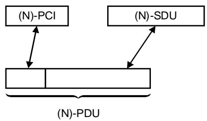

a) Neither segmenting nor blocking

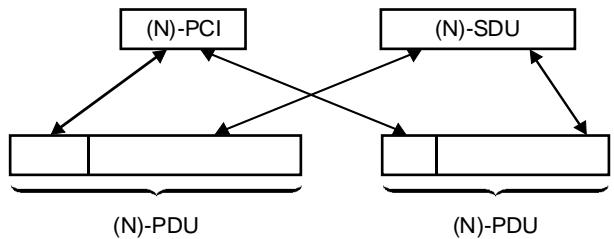

b) Segmenting/Reassembling

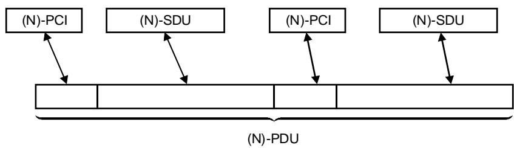

c) Blocking/Deblocking

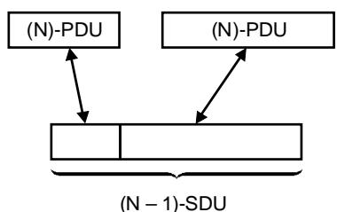

TISO2910-94/d09 

d) Concatenation/Separation 

SDU Service-data-unit 

PCI Protocol-control-information 

PDU Protocol-data-unit 

# NOTES

1 This figure does not imply any potential relationship between protocol-control-information and user-data in protocol-data-units. 

2 In the case of concatenation, (N)-protocol-data-unit does not necessarily include an (N)-service-data-unit. 

Figure 10 - Relationship between (N)-service-data-units, (N)-protocol-data-units and (N - 1)-service-data-units within a layer

# 5.8.9.2 Error detection and notification

5.8.9.2.1 Error detection and notification functions may be used by an (N)-protocol to provide a higher probability of both protocol-data-unit error detection and data corruption detection than is provided by the (N-1)-service. 

5.8.9.2.2 Error detection and notification may require that additional information be included in the (N)-protocol-control-information of (N)-protocol-data-units. 

5.8.9.2.3 In connectionless-mode, while the (N)-service provider may attempt to provide a notification upon detection of data corruption or protocol-data-unit loss, misdelivery etc., it cannot be relied upon to be capable of doing so for every instance of error detection. 

# 5.8.9.3 Reset

5.8.9.3.1 Some services require a reset function to recover from a loss of synchronization between correspondent (N)-entities. A reset function sets the correspondent (N)-entities to a predefined state with a possible loss or duplication of data. 

NOTE - Additional functions may be required to determine at what point reliable data transfer was interrupted. 

5.8.9.3.2 A quantity of (N)-user-data may be conveyed in association with the (N)-reset function. 

5.8.9.3.3 The reset function may require that information be included in the (N)-protocol-control-information of the (N)-protocol-data-unit. 

5.8.9.3.4 The reset function does not apply in connectionless-mode transmission. 

# 5.9 Routing

A routing function within the (N)-layer enables communication to be relayed by a chain of (N)-entities. The fact that communication is being routed by intermediate (N)-entities is known by neither the lower layers nor the higher layers. An (N)-entity which participates in a routing function may have a routing table. 

# 5.10 Quality Of Service (QOS)

# 5.10.1 Introduction

5.10.1.1 Quality Of Service (QOS) is the collective name given to a set of parameters associated with (N)-data transmission among (N)-service-access-points. 

5.10.1.2 There are two categories of quality of service parameters. The first category applies to both connection-mode and connectionless-mode. The second category applies only to the connection-mode service. The lists of parameters given are only examples. Individual parameters are defined for each layer. 

# 5.10.2 Connection/Connectionless parameters

5.10.2.1 These parameters apply for the provision of either the (N)-connection-mode service or the (N)-connectionless-mode service. 

# 5.10.2.2 Single transmission related parameters

5.10.2.2.1 For the (N)-connection-mode service, the parameters are negotiated during establishment of the (N)-connection. For the connectionless-mode service, the parameters are defined entirely by the behavior of a single (N)-data-transmission and are the same as those defined for the (N)-connection-mode service. Possible parameters are: 

a) expected transmission delay; 

b) probability of corruption; 

c) probability of loss or duplication; 

d) probability of wrong delivery; 

e) cost; 

f) protection from unauthorized access; and 

g) priority. 

# 5.10.2.3 Multiple transmission related parameters

5.10.2.3.1 The parameters apply for multiple (N)-data-transmissions between pairs of (N)-service-access-points. Possible parameters are: 

a) expected throughput; and 

b) probability of out of sequence delivery. 

# 5.10.3 Connection-mode parameters

5.10.3.1 These parameters apply only to the (N)-connection-mode service and are negotiated by (N)-protocol during the establishment of the (N)-connection. 

# 5.10.3.2 Possible parameters are:

a) connection establishment delay; 

b) connection establishment failure probability; 

c) connection release delay; 

d) connection release failure probability; 

e) connection resilience. 

# 6 Introduction to the specific OSI layers

# 6.1 Specific layers

6.1.1 The general structure of the OSI architecture described in clause 5 provides architectural concepts from which the Reference Model of Open Systems Interconnection has been derived, making specific choices for the layers and their contents. 

6.1.2 The Reference Model contains seven layers: 

a) the Application Layer (layer 7); 

b) the Presentation Layer (layer 6); 

c) the Session Layer (layer 5); 

d) the Transport Layer (layer 4); 

e) the Network Layer (layer 3); 

f) the Data Link Layer (layer 2); and 

g) the Physical Layer (layer 1). 

6.1.3 These layers are illustrated in Figure 11. 

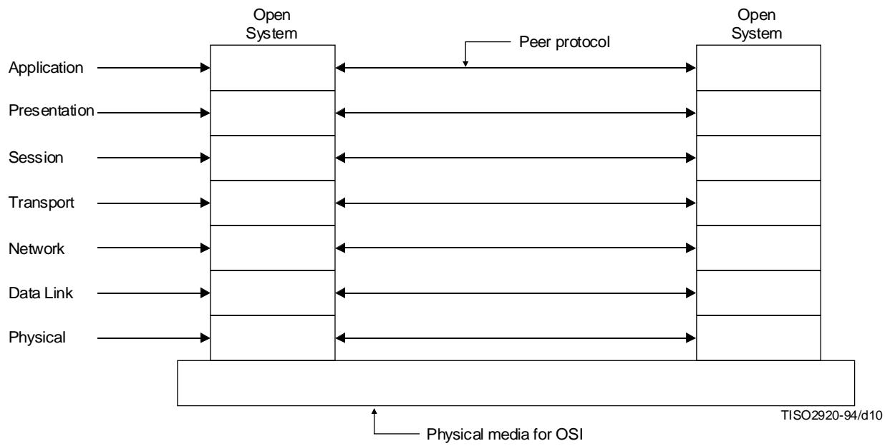

Figure 11 - Seven layer reference model and peer protocols

6.1.4 The highest is the Application Layer and it consists of the application-entities that cooperate in the OSI Environment. The lower layers provide the services through which the application-entities cooperate. 

6.1.5 Layers 1 to 6, together with the physical media for OSI provide a step-by-step enhancement of communication services. The boundary between two layers identifies a stage in this enhancement of services at which an OSI service standard is defined while the functioning of the layers is governed by OSI protocol standards. 

6.1.6 Not all open systems provide the initial source or final destination of data. When the physical media for OSI do not link all open systems directly, some open systems act only as relay open systems, passing data to other open systems. The functions and protocols which support the forwarding of data are then provided in the lower layers. This is illustrated in Figure 12. 

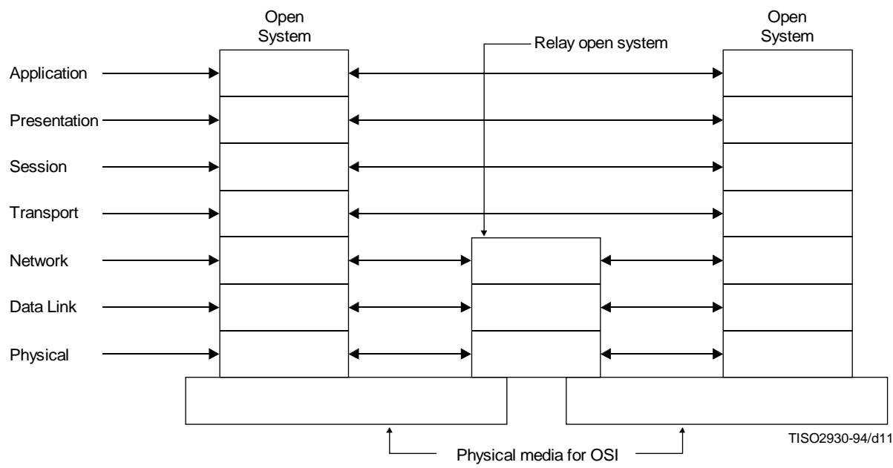

Figure 12 - Communication involving relay open systems

# 6.2 The principles used to determine the seven layers in the Reference Model

6.2.1 The following principles have been used to determine the seven layers in the Reference Model and are felt to be useful for guiding further decisions in the development of OSI standards: 

NOTE - It may be difficult to prove that any particular layering selected is the best possible solution. However, there are general principles which can be applied to the question of where a boundary should be placed and how many boundaries should be placed. 

a) Do not create so many layers as to make the system engineering task of describing and integrating the layers more difficult than necessary. 

b) Create a boundary at a point where the description of services can be small and the number of interactions across the boundary are minimized. 

c) Create separate layers to handle functions that are manifestly different in the process performed or the technology involved. 

d) Collect similar functions into the same layer. 

e) Select boundaries at a point which past experience has demonstrated to be successful. 

f) Create a layer of easily localized functions so that the layer could be totally redesigned and its protocols changed in a major way to take advantage of new advances in architectural, hardware or software technology without changing the services expected from and provided to the adjacent layers. 

g) Create a boundary where it may be useful at some point in time to have the corresponding interface standardized. 

# NOTES

1 Advantages and drawbacks of standardizing internal interfaces within open systems are not considered in this Recommendation | International Standard. In particular, mention of, or reference to principle g), should not be taken to imply usefulness of standards for such internal interfaces. 

2 It is important to note that OSI per se does not require interfaces within open systems to be standardized. Moreover, whenever standards for such interfaces are defined, adherence to such internal interface standards can in no way be considered as a condition of openness. 

h) Create a layer where there is a need for a different level of abstraction in the handling of data, for example morphology, syntax, semantics. 

j) Allow changes of functions or protocols to be made within a layer without affecting other layers; and 

k) create for each layer, boundaries with its upper and lower layer only. 

Similar principles have been applied to sublayering: 

m) Create further subgrouping and organization of functions to form sublayers within a layer in cases where distinct communication services need it. 

n) Create, where needed, two or more sublayers with a common, and therefore minimal functionality to allow interface operation with adjacent layers; and 

p) allow by-passing of sublayers. 

# 6.3 Layer descriptions

6.3.1 For each of the seven layers identified above, clause 7 provides: 

a) an outline of the purpose of the layer; 

b) a description of the services offered by the layer to the layer above; and 

c) a description of the functions provided in the layer and the use made of the services provided by the layer below. 

The descriptions, by themselves, do not provide a complete definition of the services and protocols for each layer. These are the subject of separate standards. 

6.3.2 The facilities and functions listed in clause 7 for each layer represent the set of architectural possibilities. A service definition derived from these definitions for a particular layer may include some, or all of the facilities and it may be characterized by none, some or all of the QoS parameters defined for the layer in clause 7 and in 5.10. A protocol specification derived from these definitions for a particular layer may invoke some or all of the functions defined for the layer. Such a service or protocol is constrained to not utilize nor invoke facilities or functions that are not listed. 

# 6.4 Combinations of connection-mode and connectionless-mode

6.4.1 The provision of connectionless-mode and connection-mode services in specific layers of the Reference Model and the characteristics of these services, together with the provision of functions providing for conversion within a layer between one mode of service and another, should be such as to ensure that it is possible to determine whether or not interworking between open systems is possible. In order to maximize the possibility of interworking and to limit protocol complexity, there is a restriction on the number of layers within which conversion between one mode of service and the other may take place. This restriction applies to the layers as follows: 

a) Special considerations apply to the Physical and Data Link Layers. Connection-mode and connectionless-mode services are not differentiated for the Physical Layer. The services of the Physical Layer are determined by the characteristics of the underlying medium and are too diverse to allow categorization into connection-mode and connectionless-mode operation. Functions in the Data Link Layer must convert between the services offered by the Physical Layer and the type of Data Link service needed. 

b) Conversion may be provided in the Network Layer to support a network service of a given mode over a Data Link or subnetwork service of the other mode. This, in conjunction with relaying, provides an end-to-end network service of a given mode over concatenated subnetworks and/or Data Link services of either mode (see 5.3.4). Support of such conversions, where they are necessary to provide a given mode of network service, is a requirement of OSI standards. 

c) Conversion may be provided in the Transport Layer on condition that this makes use of only limited additional protocol functions over those required to support a given mode of transport service over the same mode of network service. Since relaying is not permitted in the Transport Layer, such conversions can only be applied between end-systems. Support for such conversions is not a requirement of OSI standards. 

d) Conversion in the Session and Presentation Layer is not permitted. 

e) No conversion restrictions are imposed at the Application Layer. 

NOTE - It is not possible (since a transport protocol operates between end-systems) for a transport protocol to provide the transport service in an instance of communication between two end-systems utilizing (in that instance of communication) different modes of network service. 

# 6.4.2 It follows from these restrictions that:

a) A real open system as defined in 4.1.2 shall support a given mode of transport service over a network service of the same mode (utilizing conversion within the Network Layer if necessary); such a system may, in addition, provide conversion in the Transport Layer. 

b) A real system which only supports a given mode of transport service by providing conversion in the Transport Layer from a network service of the other mode is not fully open as defined in 4.1.2, since such a system would be incapable of communicating with a system which only supports the given mode of transport service over a network service of the same mode. 

NOTE - The restriction that a given mode of transport service has to be supported by the same mode of network service is applied so that systems may communicate without requiring prior agreement on the mode of network service to be used. Where prior agreement exists this restriction need not apply, although the requirements for systems to be fully open are as stated in item a) above. 

# 6.5 Configurations of OSI Open Systems

# 6.5.1 Definitions

6.5.1.1 OSI End System: An open system, which for a particular instance of communication, is the ultimate source or destination of data. 

6.5.1.2 OSI-(N)-Relay System: An open system which, for a particular instance of communication, makes use of OSI functions up to and including functions of the (N)-layer and where a relay function is executed within the (N)-layer. 

# 6.5.2 Properties

6.5.2.1 The Reference Model is not restricted to configurations in which only two real open systems participate in an instance of communication nor to configurations in which all participating real open systems are connected to one another by the same physical medium. It also considers configurations in which communication between real open systems involves other real open systems providing relay functions (see 5.3). 

6.5.2.2 In order to distinguish between the roles of real open systems involved in an instance of communication, a real open system in which there is an application-process acting either as final source or destination of data is termed an (OSI) end real open system for that instance of communication, and a real open system which is providing a relay function at layer N is termed an OSI (N)-relay system for that instance of communication. 

6.5.2.3 From the point of view of a particular instance of communication a real open system may be acting in the role either of an OSI end system or an OSI (N)-relay system, but it does not necessarily act in the same way for all instances of communication in which it is involved. These different views of the same open system may appear successively, or even simultaneously when the open system is engaged in several communications with the same or different open systems. 

6.5.2.4 In configurations involving OSI-(N)-relay systems, the Reference Model considers the case where several subnetworks (see 7.5.1) are used in tandem or in parallel (see 7.5.2.3). This involves routing and relaying functions to establish connections through such networks of OSI-(N)-relay systems. Such functions, which support the forwarding of data through OSI-(N)-relay systems, are provided in the lower three layers (see 6.1) or in the Application Layer. 

6.5.2.5 In the context of distributed applications, relaying may be performed in application-entities. 

6.5.2.6 Thus transport-entities are only involved in instances of communication where the open systems act as OSI end systems or as OSI-(N)-relay systems when the relaying function occurs in the Application Layer. 

# 7 Detailed description of the resulting OSI architecture

# 7.1 Application Layer

# 7.1.1 Definitions

7.1.1.1 application-entity: An active element, within an application process, embodying a set of capabilities which is pertinent to OSI and which is defined for the Application Layer, that corresponds to a specific application-entity-type (without any extra capabilities being used). 

7.1.1.2 abstract syntax: The specification of Application-protocol-data-units by using notation rules which are independent of the encoding technique used to represent them. 

# 7.1.2 Purpose

7.1.2.1 As the highest layer in the Reference Model of Open Systems Interconnection, the Application Layer provides the sole means for the application process to access the OSIE. Hence the Application Layer has no boundary with a higher layer. 

7.1.2.2 The aspects of an application process which need to be taken into account for the purpose of OSI are represented by one or more application-entities. 

7.1.2.3 An application-entity represents one and only one application process in the OSIE. Different application processes may be represented by application-entities of the same application-entity-type. An application process may be represented by a set of application-entities: each application-entity in this set may be, but need not be, of different application-entity-type. 

# 7.1.3 Services provided by application-entities

# 7.1.3.1 General

7.1.3.1.1 Application-processes exchange information by means of application-entities which use application-protocols and presentation services. 

7.1.3.1.2 As the only layer in the Reference Model that directly provides services to the application-processes, the Application Layer necessarily provides all OSI services directly usable by application-processes. 

7.1.3.1.3 There exists no Application Layer service in the sense of (N)-layer service in that there is neither a general service provided to an upper layer nor a relation to a service-access-point. 

NOTE - The related concept of OSI-service, defined in ISO/IEC 10731, is applicable in the Application Layer. 

# 7.1.3.2 Connection-mode facilities

In addition to information transfer, such facilities may include, but are not limited to the following: 

a) identification of the intended communication partners (for example by name, by address, by definite description, by generic description); 

b) determination of the acceptable quality of service (for example response time, tolerable error rate, cost vis-a-vis the previous considerations); 

c) synchronization of cooperating applications; 

d) agreement on responsibility for error recovery; 

e) agreement on security aspects (e.g. authentication, access control, data integrity); 

f) selection of mode of dialogue; and 

g) identification of abstract syntaxes. 

# 7.1.3.3 Connectionless-mode facilities

7.1.3.3.1 Where appropriate for connectionless-mode operation, equivalent facilities to those provided for connectionmode operation are provided in the Application Layer to application-processes. 

7.1.3.3.2 In addition to information transfer, such facilities constituting the service may include, but are not limited to, the following: 

a) identification of intended communication partners; 

b) establishment of authority to communicate; 

c) authorization of intended communication partners; 

d) determination of the acceptable quality of service; and 

e) identification of abstract syntaxes. 

# 7.1.4 Functions within the Application Layer

7.1.4.1 The Application Layer contains all those functions which imply communication in either mode between open systems that are not already performed by the lower layers. These include functions performed by programs as well as functions performed by human beings. 

7.1.4.2 In particular, application-entities maintain, as part of the pre-knowledge necessary in order to communicate, (or have access to, via use of a directory facility) information on the use of connection-mode and/or connectionless-mode transmission by the peer entities with which they may need to communicate. 

# 7.1.4.3 Groupings of functions in the Application Layer

An application-entity can be structured internally into Application Layer objects representing groups of functions. Use of one grouping of functions may depend on use of some other functions, and the active functions may vary during the lifetime of the application-association. 

# 7.2 Presentation Layer

# 7.2.1 Definitions

7.2.1.1 concrete syntax: Those aspects of the rules used in the formal specification of data which embody a specific representation of that data. 

7.2.1.2 transfer syntax: The abstract and concrete syntax used in the transfer of data between open systems. 

7.2.1.3 presentation context: An association of an abstract syntax with a transfer syntax. 

# 7.2.2 Purpose

7.2.2.1 The Presentation Layer provides for the representation of information that application-entities either communicate or refer to in their communication. 

7.2.2.2 The Presentation Layer provides for common representation of the data transferred between application-entities. This relieves application-entities of any concern with the problem of "common" representation of information, i.e. it provides them with syntax independence. 

7.2.2.3 The Presentation Layer ensures that the information content of the Application Layer data is preserved during transfer. Cooperating application-entities are responsible for determining the set of abstract syntaxes they employ in their communication. The Presentation Layer is informed of the abstract syntaxes that are to be employed. Knowing the set of abstract syntaxes to be used by the application-entities, the Presentation Layer is responsible for selecting mutually acceptable transfer syntaxes. 

NOTE - Presentation-entities have no role in determining the set of abstract syntaxes to be used by the application-entities. 

# 7.2.3 Services provided to the Application Layer

7.2.3.1 The Presentation Layer provides the following facilities: 

a) identification of a set of transfer syntaxes; 

b) selection of transfer syntax; and 

c) access to session services. 

7.2.3.2 Identification of a set of transfer syntaxes provides one or more means of representing an abstract syntax. Selection of transfer syntax provides the means of initially selecting a transfer syntax and subsequently modifying the selection. 

7.2.3.3 Session services are provided to application-entities in the form of presentation services. 

7.2.3.4 In connectionless-mode, segmentation and resassembly are not provided in the Presentation Layer. Thus, the size of presentation-service-data-units is limited by the size of presentation-protocol-data-units and presentation-protocol-control-information. 

# 7.2.4 Functions within the Presentation Layer

The Presentation Layer performs the following functions to help accomplish the presentation-services: 

a) negotiation and re-negotiation of transfer syntax; 

b) representation of the abstract syntax chosen by the application-entities in the transfer syntax negotiated or renegotiated, including format and special purpose transformations (for example, data compression); 

c) restoration of previously negotiated syntaxes on the occurrence of certain events; and 

d) use of session-services. 

# 7.2.4.1 Representation of abstract syntax

7.2.4.1.1 Application-entities agree on the abstract syntaxes that will be used for their communication. It is necessary that these abstract syntaxes are represented in appropriate transfer syntaxes for communication to take place. 

NOTE - Within a real open system, data defined in terms of an abstract syntax will be represented within the local system environment by a local concrete syntax. A transformation may be necessary between the local concrete syntax and the transfer syntax. Thus, in communication between real open systems there are three concrete syntax versions of the data: the concrete syntax used by the originating application-entity, the concrete syntax used by the receiving application-entity, and the concrete syntax used between the presentation-entities (the transfer syntax). It is clearly possible that any or all of these syntaxes be identical. The local concrete syntaxes are not visible within the OSIE. 

7.2.4.1.2 The fact that there is or is no actual transformation of concrete syntax has no impact on the presentation-protocol. 

7.2.4.1.3 There is not a single predetermined transfer syntax for all OSI. In connection-mode, the transfer syntax to be used on a presentation-connection is negotiated between the correspondent presentation-entities. 

7.2.4.1.4 In connectionless-mode, the transfer syntax is selected, but cannot be negotiated. 

# 7.2.4.2 Negotiation of transfer syntax

7.2.4.2.1 Negotiation (or selection) of transfer syntax takes place between two presentation-entities when an application-entity provides the name of an abstract syntax for which a transfer syntax is required. 

7.2.4.2.2 In general, there may be more than one combination of abstract syntax and transfer syntax. It may be possible to represent a specific abstract syntax by one or more transfer syntaxes; also it may be possible to use one transfer syntax to represent more than one abstract syntax. Each combination of abstract syntax and transfer syntax is called a presentation context. From the viewpoint of the application-entity, a presentation context represents a specific distinct use of an abstract syntax. 

# 7.2.4.3 Addressing and Multiplexing

There is no multiplexing or splitting in the Presentation Layer. 

# 7.3 Session Layer

# 7.3.1 Definitions

7.3.1.1 token management: A facility of the session-service which allows correspondent presentation-entities to control explicitly whose right it is to exercise certain session-services. 

7.3.1.2 duplex mode: A mode of interaction where both presentation-entities may concurrently send and receive normal data. 

7.3.1.3 half-duplex mode: A mode of interaction where, at a given instance, only one of the two correspondent presentation-entities is allowed to send normal data. 

7.3.1.4 session-connection synchronization: A facility of the session-service which allows presentation-entities to define and to identify synchronization points and to reset a session-connection to a predefined state and to agree on a resynchronization point. 

# 7.3.2 Purpose

7.3.2.1 The purpose of the Session Layer is to provide the means necessary for cooperating presentation-entities to organize and to synchronize their dialogue and to manage their data exchange. To do this, the Session Layer provides services to establish a session-connection between two presentation-entities, to support orderly data exchange interactions, and to release the connection in an orderly manner. 

7.3.2.2 The only function of the Session Layer for connectionless-mode communication is to provide a mapping of transport-addresses to session-addresses. 

7.3.2.3 A session-connection is created when requested by a presentation-entity at a session-service-access-point. The session-connection exists until it is released by either the presentation-entities or the session-entities. 

7.3.2.4 The initiating presentation-entity designates the destination presentation-entity by a session address. In general, there is a many-to-one correspondence between the session-addresses and transport-addresses. This does not imply multiplexing of session-connections onto transport-connections, but does imply that at session-connection establishment time, more than one presentation-entity is a potential target of a session-connection establishment request arriving on a given transport-connection. However, when needed, there may be a one-to-one correspondence between the session-address and the transport-address. 

# 7.3.3 Services provided to the Presentation Layer

# 7.3.3.1 General

7.3.3.1.1 In connection-mode, the services provided by the Session Layer are described below: 

a) session-connection establishment; 

b) session-connection release; 

c) normal data transfer; 

d) expedited data transfer; 

e) token management; 

f) session-connection synchronization; 

g) exception reporting; 

h) activity management; 

j) typedef data transfer; and 

k) resynchronization. 

7.3.3.1.2 In connectionless-mode, the Session Layer provides the following services: 

a) connectionless-mode transmission using the transport-connectionless-mode service; and 

b) exception reporting. 

7.3.3.1.3 In connectionless-mode, segmentation and resassembly are not provided in the Session Layer. Thus, the size of session-service-data-units is limited by the size of session-protocol-data-units and session-protocol-control-information. 

# 7.3.3.2 Session-connection establishment

7.3.3.2.1 The session-connection establishment service enables two presentation-entities to establish a session-connection between them. The presentation-entities are identified by session-addresses used to request the establishment of the session-connection. 

7.3.3.2.2 The session-connection establishment service allows the presentation-entities to determine cooperatively the unique values of session-connection parameters at the time the session-connection is established. 

7.3.3.2.3 The session-connection establishment service provides a session-connection identification parameter which allows the presentation-entities to identify the session-connection. 

# 7.3.3.3 Session-connection release

7.3.3.3.1 The session-connection release service allows presentation-entities to release a session-connection in a orderly way without loss of data. It also allows either presentation-entity to request at any time that a session-connection be aborted; in this case, data may be lost. 

7.3.3.3.2 A session-connection may also be aborted by one of the session-entities supporting it. 

# 7.3.3.4 Normal data transfer

The normal data transfer service allows a sending presentation-entity to transfer a session-service-data-unit to a receiving presentation-entity. 

# 7.3.3.5 Expedited data transfer

The expedited data transfer service provides expedited handling of the transfer of expedited session-service-data-units. A specific size restriction is placed on expedited session-service-data-units. 

# 7.3.3.6 Token management

The token management service allows the presentation-entities to control explicitly whose turn it is to exercise certain control functions. 

# 7.3.3.7 Session-connection synchronization

7.3.3.7.1 The session-connection synchronization service allows presentation-entities: 

a) to define and identify synchronization points; and 

b) to reset the session-connection to a defined state and agree on a resynchronization point with the potential of the loss of data. 

7.3.3.7.2 Any semantics which session-service users may give to their synchronization points are transparent to the session-service provider. 

7.3.3.7.3 The Session Layer is not responsible for any associated checkpointing or commitment action associated with synchronization. 

7.3.3.7.4 Symmetric synchronization allows synchronization points to be set independently on the two directions of the flow. 

# 7.3.3.8 Exception reporting

The exception reporting service permits the presentation-entities to be notified of exceptional situations. 

# 7.3.3.9 Activity management

The activity concept allows session-service users to distinguish logical pieces of work called activities. Each activity consists of one or more dialog units. Only one activity is allowed on a session-connection at a time, but there may be serveral consecutive activities during a session-connection. An activity may also span more than one session-connection. Activities can also be interrupted and then resumed on the same or a subsequent session-connection. 

# 7.3.3.10Typed Data Transfer

The typed data transfer service allows a sending presentation-entity to transfer a session-service-data-unit to a receiving presentation-entity independent of the provisions of token management. 

# 7.3.3.11 Resynchronization

Resynchronization may be initiated by either session-service user. It sets the session-connection to a defined state and therefore includes reassignment of tokens and setting the synchronization point serial number to a new value. Resynchronization may purge undelivered data. 

# 7.3.4 Functions within the Session Layer

7.3.4.1 The functions within the Session Layer are those which shall be performed by session-entities in order to provide the session-services. When providing the connectionless-mode service, the Session Layer provides a one-to-one mapping of Session-connectionless-mode-transmissions onto transport-connectionless-mode-transmissions. 

7.3.4.2 Most of the functions required are readily implied by the services provided. Additional description is given below for the following functions: 

a) session-connection to transport-connection mapping; and 

b) session-connection flow control. 

# 7.3.4.3 Session-connection to transport-connection mapping

There is a one-to-one mapping between a session-connection and a transport-connection at any given instant. However, the lifetime of a transport-connection and that of a related session-connection can be distinguished so that a transport-connection supports several consecutive session-connections. 

# 7.3.4.4 Session-connection flow control

There is no peer flow control in the Session Layer. To prevent the receiving presentation-entity from being overloaded with data, the receiving session-entity applies back pressure across the transport-connection using the transport flow control. 

# 7.4 Transport Layer

# 7.4.1 Definitions

No Transport Layer specific terms are identified. 

# 7.4.2 Purpose

7.4.2.1 The transport-service provides transparent transfer of data between session-entities and relieves them from any concern with the detailed way in which reliable and cost effective transfer of data is achieved. 

7.4.2.2 The Transport Layer optimizes the use of the available network-service to provide the performance required by each session-entity at minimum cost. This optimization is achieved within the constraints imposed by the overall demands of all concurrent session-entities and the overall quality and capacity of the network-service available to the Transport Layer. 

7.4.2.3 All protocols defined in the Transport Layer have end-to-end significance, where the ends are defined as transport entities having transport associations. Therefore, the Transport Layer is OSI end open system oriented and transport-protocols operate only between OSI end open systems. 

7.4.2.4 The Transport Layer is relieved of any concern with routing and relaying since the network-service provides data transfer from any transport-entity to any other, including the case of tandem subnetworks (see 7.5.1). 

7.4.2.5 The transport functions invoked in the Transport Layer to provide a requested service quality depend on the quality of the network-service. The quality of the network-service depends on the way the network-service is achieved (see 7.5.3). 

# 7.4.3 Services provided to the Session Layer

# 7.4.3.1 Introduction

7.4.3.1.1 The Transport Layer uniquely identifies each session-entity by its transport-address. When providing the connectionless-mode service, the Transport Layer provides a connectionless-mode service which maps a request for transmission of a transport-service-data-unit onto a request to the connectionless-mode network-service. In connection-mode, the transport-service provides the means to establish, maintain, and release transport-connections. Transport-connections provide duplex transmission between a pair of session-entities (through transport-SAPs). 

7.4.3.1.2 More than one transport-connection can be established between the same pair of transport-addresses. A session-entity uses transport-connection-endpoint-identifiers provided by the Transport Layer to distinguish between transport-connection-endpoints. 

7.4.3.1.3 The operation of one transport-connection is independent of the operation of all others except for the limitations imposed by the finite resources available to the Transport Layer. 

7.4.3.1.4 The quality of service provided on a transport-connection depends on the service class requested by the session-entities when establishing the transport-connection. The selected quality of service is maintained throughout the lifetime of the transport-connection. The session-entity is notified of any failure to maintain the selected quality of service on a given transport-connection. 

7.4.3.1.5 In connection-mode, the following facilities provided by the Transport Layer are described below: 

a) transport-connection establishment; 

b) transport-connection release; 

c) data transfer; 

d) expedited data transfer; and 

e) suspend facility. 

7.4.3.1.6 In connectionless-mode, segmentation and resassembly are not provided in the Transport Layer. Thus, the size of transport-service-data-units is limited by the size of transport-protocol-data-units and transport-protocol-control-information. 

# 7.4.3.2 Transport-connection establishment

7.4.3.2.1 Transport-connections are established between session-entities identified by transport-addresses. The quality of service of the transport-connection is negotiated between the session-entities and the transport-service. 

7.4.3.2.2 At the time of establishment of a transport-connection the class of transport-service to be provided can be selected from a defined set of available classes of service. 

7.4.3.2.3 These service classes are characterized by combinations of selected values of parameters such as throughput, transit delay, and connection set-up delay and by guaranteed values of parameters such as residual error rate and service availability. 

7.4.3.2.4 These classes of service represent globally predefined combinations of parameters controlling quality of service. These classes of service are intended to cover the transport-service requirements of the various types of traffic generated by the session-entities. 

# 7.4.3.3 Transport-connection release

This facility provides the means by which either session-entity can release a transport-connection and have the correspondent session-entity informed of the release. 

# 7.4.3.4 Data transfer

This facility provides data transfer in accordance with the agreed quality of service. When the quality of service cannot be maintained and all possible recovery attempts have failed, the transport-connection is terminated and the session-entities are notified. 

a) The transport-service-data-unit transfer service provides the means by which transport-service-data-units of arbitrary length are delimited and transparently transferred in sequence from one sending transport-service-access-point to the receiving transport-service-access-point over a transport-connection. This service is subject to flow control. 

b) The expedited transport-service-data-unit transfer service provides an additional means of information exchange on a transport-connection. The expedited transport-data-units are subject to their own set of transport-service and flow control characteristics. The maximum size of expedited transport-service-data-units is limited. 

# 7.4.3.5 Expedited Data

An expedited service is provided by the Transport Layer. However, it should be used in accordance with the constraints described in 5.8.8.3. 

# 7.4.4 Functions within the Transport Layer

# 7.4.4.1 General

7.4.4.1.1 In connection-mode, the Transport Layer functions may include: 

a) mapping transport-address onto a network-address; 

b) multiplexing (end-to-end) transport-connections onto network-connections; 

c) establishment and release of transport-connections; 

d) end-to-end sequence control on individual connections; 

e) end-to-end error detection and any necessary monitoring of the quality of service; 

f) end-to-end error recovery; 

g) end-to-end segmenting, blocking, and concatenation; 

h) end-to-end flow control on individual connections; 

j) supervisory functions; 

k) expedited transport-service-data-unit transfer; and 

1) suspend/resume. 

7.4.4.1.2 In connectionless-mode, the Transport Layer provides the following functions to support connectionless-mode transmission: 

a) mapping between transport-addresses and network-addresses; 

b) mapping end-to-end transport-connectionless-mode transmissions on to network-connectionless-mode transmissions; 

NOTE - There may be specific situations where performing conversion from connection-mode to connectionless-mode operation in the Transport Layer can be justified and may thus be permitted provided that this requires only limited extensions to existing protocols. In such cases it is accepted that communication using such conversions can only take place between OSI end systems supporting them (see 6.4). 

c) end-to-end error detection and monitoring of the quality of service; 

d) transport-service-data-unit delimiting; and 

e) supervisory functions. 

# 7.4.4.2 Addressing

7.4.4.2.1 When a session-entity requests the Transport Layer to establish a transport-connection with another session-entity identified by its transport-address, the Transport Layer determines the network-address identifying the transport-entity which serves the correspondent session-entity. 

7.4.4.2.2 Because transport-entities support services on an end-to-end basis no intermediate transport-entity is involved as a relay between the end transport-entities. Therefore the Transport Layer maps transport-addresses to the network-addresses which identify the end transport-entities (see Figure 13). 

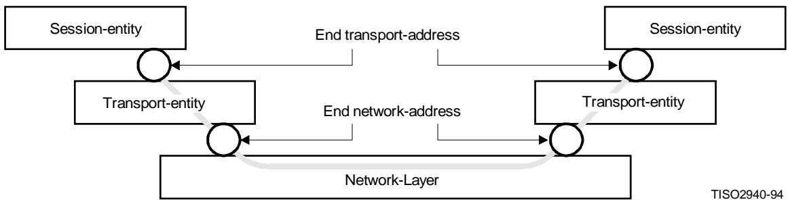

Figure 13 - Association of transport-addresses and network address

7.4.4.2.3 One transport-entity may serve more than one session-entity. Several transport-addresses may be associated with one network-address within the scope of the same transport-entity. Corresponding mapping functions are performed within the transport-entities to provide these facilities (see Figure 14). 

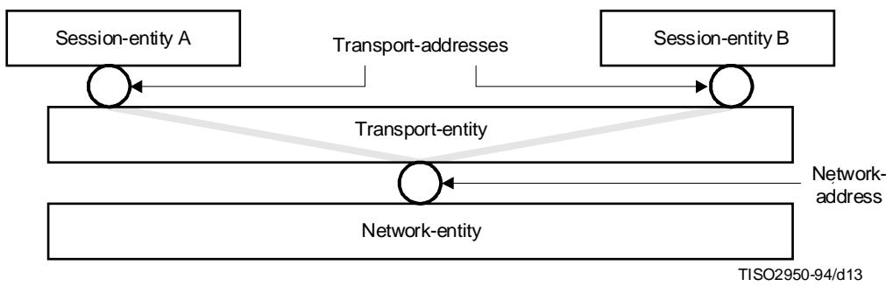

Figure 14 - Association of one network address with several transport addresses

# 7.4.4.3 Connection multiplexing and splitting

In order to optimize the use of network-connections, the mapping of transport-connections onto network-connections need not be on a one-to-one basis. Both splitting and multiplexing may be performed, namely for optimizing the cost of usage of the network-service. 

# 7.4.4.4 Phases of operation

In connection-mode operation, the phases of operation within the Transport Layer are: 

a) establishment phase; 

b) data transfer phase; and 

c) release phase. 

The transfer from one phase of operation to another is specified in detail within the protocol for the Transport Layer. 

# 7.4.4.5 Establishment phase

During the establishment phase, the Transport Layer establishes a transport-connection between two session-entities. The functions of the Transport Layer during this phase match the requested class of service with the services provided by the Network Layer. The following functions can be performed during this phase: 

a) obtain a network-connection which best matches requirements of the session-entity, taking into account cost and quality of service; 

b) decide whether multiplexing or splitting is needed to optimize the use of network-connections; 

c) establish the optimum transport-protocol-data-unit size; 

d) select the functions that will be operational upon entering the data transfer phase; 

e) map transport-addresses onto network-addresses; 

f) provide identification of different transport-connections between the same pair of transport-service-access-points (connection identification function); and 

g) transfer of data. 

# 7.4.4.6 Data transfer phase

The purpose of the data transfer phase is to transfer transport-service-data-units between the two session-entities connected by the transport-connection. This is achieved by the transportation of transport-protocol-data-units and by the following functions, each of which is used or not used according to the class of service selected in the establishment phase: 

a) sequencing; 

b) blocking; 

c) concatenation; 

d) segmenting; 

e) multiplexing or splitting; 

f) flow control; 

g) error detection; 

h) error recovery; 

j) expedited data transfer; 

k) transport-service-data-unit delimiting; and 

m) transport-connection identification. 

# 7.4.4.7 Release phase

The purpose of the release phase is to release the transport-connection. It may include the following functions: 

a) notification of reason for release; 

b) identificaton of the transport-connection released; and 

c) transfer of data. 

# 7.4.4.8 Transport Layer management

The Transport Layer protocols deal with some management activities of the layer (such as activation and error control). See clause 8 and ITU-T Rec. X.700 | ISO 7498-4 for the relationship with other management aspects. 

# 7.5 Network Layer

# 7.5.1 Definitions

7.5.1.1 real subnetwork: A collection of equipment and physical media which forms an autonomous whole and which can be used to interconnect real systems for the purpose of data transfer. 

7.5.1.2 subnetwork: An abstraction of a real subnetwork. 

# NOTES

1 A subnetwork is a representation within the OSI Reference Model of a real network such as a carrier network, a private network, or a local area network. 

2 A subnetwork may itself be an open system, although this is not necessarily always the case. See ISO 8648 – Internal Organization of the Network Layer. 

7.5.1.3 subnetwork-connection: A communication path through a subnetwork which is used by entities in the Network Layer in providing a network-connection. 

# 7.5.2 Purpose

7.5.2.1 The Network Layer provides the functional and procedural means for connectionless-mode or connectionmode transmission among transport-entities and, therefore, provides to the transport-entities independence of routing and relay considerations. 

7.5.2.2 The Network Layer provides the means to establish, maintain, and terminate network-connections between open systems containing communicating application-entities and the functional and procedural means to exchange network-service-data-units between transport-entities over network-connections. 

7.5.2.3 It provides to the transport-entities independence from routing and relay consideration associated with the establishment and operation of a given network-connection. This includes the case where several subnetworks are used in tandem (see 7.5.4.2) or in parallel. It makes invisible to transport-entities how underlying resources such as data-link-connections are used to provide network-connections. 

7.5.2.4 Any relay functions and hop-by-hop service enhancement protocols used to support the network-service between the OSI end systems are operating below the Transport Layer, i.e. within the Network Layer or below. 

# 7.5.3 Service provided to the Transport Layer

# 7.5.3.1 Introduction

7.5.3.1.1 The basic service of the Network Layer is to provide the transparent transfer of data between transport-entities. This service allows the structure and detailed content of submitted data to be determined exclusively by layers above the Network Layer. 

7.5.3.1.2 All facilities are provided to the Transport Layer at a known cost. 

7.5.3.1.3 The Network Layer contains functions necessary to provide the Transport Layer with a firm Network/Transport Layer boundary which is independent of the underlying communications media in all things other than quality of service. Thus the Network Layer contains functions necessary to mask the differences in the characteristics of different transmission and subnetwork technologies into a consistent network service. 

7.5.3.1.4 The service provided at each end of a network-connection is the same even when a network-connection spans several subnetworks, each offering dissimilar services (see 7.5.4.2). 

NOTE - It is important to distinguish the specialized use of the term "service" within the OSI Reference Model from its common use by suppliers of private networks and carriers. 

7.5.3.1.5 The quality of service is negotiated between the transport-entities and the network-service at the time of establishment of a network-connection. While this quality of service may vary from one network-connection to another it will be agreed for a given network-connection and be the same at both network-connection-endpoints. 

7.5.3.1.6 In connection-mode, the facilities provided by the Network Layer are described below: 

a) network-addresses; 

b) network-connections; 

c) network-connection-endpoint-identifiers; 

d) network-service-data-unit transfer; 

e) quality of service parameters; 

f) error notification; 

g) expedited network-service-data-unit transfer; 

h) reset; 

j) release; and 

k) receipt of confirmation. 

7.5.3.1.7 Some of these facilities are optional. This means that: 

a) the user has to request the facilities; and 

b) the network-service provider may honour the request or indicate that the service is not available. 

7.5.3.1.8 In connectionless-mode, the facilities provided by the Network Layer, operating among network-service-access-points, are: 

a) transmission of network-service-data-units of a defined maximum size; 

b) quality of service parameters; and 

c) local error notification. 

# 7.5.3.2 Network-addresses

Transport-entities are known to the Network Layer by means of network-addresses. Network-addresses are provided by the Network Layer and can be used by transport-entities to identify uniquely other transport-entities, i.e. network-addresses are necessary for transport-entities to communicate using the network-service. The Network Layer uniquely identifies each of the end open systems (represented by transport-entities) by their network-addresses. This may be independent of the addressing needed by the underlaying layers. 

# 7.5.3.3 Network-connections

7.5.3.3.1 A network-connection provides the means of transferring data between transport-entities identified by network-SAP-addresses. The Network Layer provides the means to establish, maintain and release network-connections. 

7.5.3.3.2 A network-connection is point-to-point. 

7.5.3.3.3 More than one network-connection may exist between the same pair of transport-entities (through the network-SAP-addresses). 

# 7.5.3.4 Network-connection-endpoint-identifiers

The Network Layer provides to the transport-entity a network-connection-endpoint-identifier which uniquely identifies the network-connection-endpoint with the associated network-SAP-address. 

# 7.5.3.5 Network-service-data-unit transfer

7.5.3.5.1 On a network-connection, the Network Layer provides for the transmission of network-service-data-units. These units have a distinct beginning and end and the integrity of the unit's content is maintained by the Network Layer. 

7.5.3.5.2 In connection-mode, no limit is imposed on the maximum size of network-service-data-units. 

7.5.3.5.3 The network-service-data-units are transferred transparently between transport-entities. 

# 7.5.3.6 Quality of service parameters

7.5.3.6.1 The Network Layer establishes and maintains a selected quality of service for the duration of the networkconnection. 

7.5.3.6.2 The quality of service parameters include residual error rate, service availability, reliability, throughput, transit delay (including variations), and delay for network-connection establishment. 

# 7.5.3.7 Error notification

7.5.3.7.1 Unrecoverable errors detected by the Network Layer are reported to the transport-entities. 

7.5.3.7.2 Error notification may or may not lead to the release of the network-connection, according to the specification of a particular network-service. 

# 7.5.3.8 Expedited network-service-data-unit transfer

7.5.3.8.1 The expedited network-service-data-unit transfer is optional and provides an additional means of information exchange on a network-connection. The transfer of a expedited network-service-data-units is subject to a different set of network-service characteristics and to separate flow control. 

7.5.3.8.2 The maximum size of an expedited network-service-data-unit is limited. 

7.5.3.8.3 This service is an optional service that may not always be available. 

# 7.5.3.9 Reset

The reset facility is optional and when invoked causes the Network Layer to discard all network-service-data-units in transit on the network-connection and to notify the transport-entity at the other end of the network-connection that a reset has occurred. 

# 7.5.3.10 Release

7.5.3.10.1 A transport-entity may request release of a network-connection. The network-service does not guarantee delivery of data preceding the release request and still in transit. The network-connection is released regardless of the action taken by the correspondent transport-entity. 

7.5.3.10.2 This facility is optional and may not always be available. 

# 7.5.3.11 Receipt confirmation

7.5.3.11.1 A transport-entity may confirm receipt of data over a network-connection. The use of the receipt confirmation service is agreed by the two users of the network-connection during connection establishment. 

7.5.3.11.2 This service is optional and may not always be available.4) 

# 7.5.4 Functions within the Network Layer

# 7.5.4.1 Introduction

7.5.4.1.1 Network Layer functions provide for the wide variety of configurations supporting network-connections ranging from network-connections supported by point-to-point configurations to network-connections supported by complex combinations of subnetworks with different characteristics. 

NOTE - In order to cope with this wide variety of cases, network functions should be structured into sublayers. The subdivision of the Network Layer into sublayers need only be done when this is useful. In particular, sublayering need not be used when the access protocol to the subnetwork supports the complete functionality of the OSI network-service. 

7.5.4.1.2 The following are functions performed by the Network Layer: 

a) routing and relaying; 

b) network-connections; 

c) network-connection multiplexing; 

d) segmenting and blocking; 

e) error detection; 

f) error recovery; 

g) sequencing; 

h) flow control; 

j) expedited data transfer; 

k) reset; 

m) service selection; 

n) mapping between network-addresses and data-link addresses; 

o) mapping network-connectionless-mode transmissions to data-link-connectionless-mode transmissions; 

p) converting from data-link-connection-mode service to network-connectionless-mode service; 

q) enhancing a data-link-connectionless mode service to provide a network-connection-mode service; and 

r) network layer management. 

# 7.5.4.2 Routing and relaying

7.5.4.2.1 Network-connections are provided by network-entities in OSI end systems and by intermediate open systems which provide relaying. These intermediate open systems may interconnect subnetwork-connections, data-link-connections, and data-circuits (see 7.7). Routing functions determine an appropriate route between network-addresses. In order to set up the resulting communication, it may be necessary for the Network Layer to use the services of the Data Link Layer to control the interconnection of data-circuits (see 7.6.4.10 and 7.7.3.1). 

7.5.4.2.2 The control of interconnection of data-circuits (which are in the Physical Layer) from the Network Layer requires interaction between a network-entity and a physical-entity in the same open system. Since the Reference Model permits direct interaction only between adjacent layers, the network-entity cannot interact directly with the physical-entity. This interaction is thus described through the Data Link Layer which intervenes transparently to convey the interaction between the Network Layer and the Physical Layer. 

7.5.4.2.3 This representation of the control of data-circuit interconnection is an abstract representation. It is a local matter in an open system. It does not model the functioning of real open systems and as such has no impact on the standardization of OSI protocols. 

NOTE - When Network Layer functions are performed by combinations of several individual subnetworks, the specification of routing and relaying functions could be facilitated by using sublayers, isolating individual subnetworks routing and relaying functions from internetwork routing and relaying functions. However, when subnetworks have access protocols supporting the complete functionality of the OSI network service, there need be no sublayering in the Network Layer. 

# 7.5.4.3 Network-connections

7.5.4.3.1 This function provides network-connections between transport-entities, making use of data-link-connections provided by the Data Link Layer. 

7.5.4.3.2 A network-connection may also be provided as subnetwork-connections in tandem, i.e. using several individual subnetworks in series. The interconnected individual subnetworks may have the same or different service capabilities. Each end of a subnetwork-connection may operate with a different subnetwork protocol. 

7.5.4.3.3 The interconnection of a pair of subnetworks of differing qualities may be achieved in two ways. To illustrate these, consider a pair of subnetworks, one of high quality and the other of low quality: 

a) The two subnetworks are interconnected as they stand. The quality of the resulting network-connection is not higher than that of the lower quality subnetwork (see Figure 15). 

b) The lower quality subnetwork is enhanced to equal the higher quality subnetwork and the subnetworks are then interconnected. The quality of the resulting network-connection is approximately that of the higher quality subnetwork (see Figure 16). 

The choice between these two alternatives depends on the degree of difference in quality, the cost of enhancement, and other economic factors. 

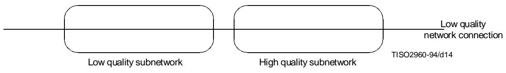

Figure 15 - Interconnection of a low quality and a high quality subnetwork

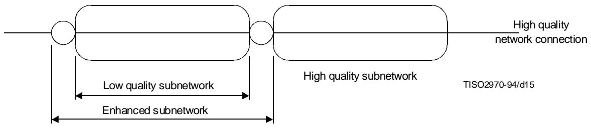

Figure 16 – Interconnection of an enhanced low quality subnetwork and a high quality subnetwork

# 7.5.4.4 Network-connection multiplexing

7.5.4.4.1 This function may be used to multiplex network-connections onto data-link-connections in order to optimize their use. 

7.5.4.4.2 In the case of subnetwork-connections in tandem, multiplexing onto individual subnetwork-connections may also be performed in order to optimize their use. 

# 7.5.4.5 Segmenting and blocking

The Network Layer may segment and/or block network-service-data-units for the purpose of facilitating the transfer. However, the network-service-data-unit delimiters are preserved over the network-connection. 

# 7.5.4.6 Error detection

Error detection functions are used to check that the quality of service provided over a network-connection is maintained. Error detection in the Network Layer uses error notification from the Data Link Layer. Additional error detection capabilities may be necessary to provide the required quality of service. 

# 7.5.4.7 Error recovery

This function provides for the recovery from detected errors. This function may vary depending on the quality of the network service provided. 

# 7.5.4.8 Sequencing

This function provides for the sequenced delivery of network-service-data-units over a given network-connection when requested by a transport-entity. 

# 7.5.4.9 Flow control

If flow control is required, this function may need to be performed. 

# 7.5.4.10 Expedited data transfer

This function provides for the expedited data transfer facility. 

# 7.5.4.11 Reset

This function provides for the reset service. 

# 7.5.4.12 Service selection

This function allows service selection to be carried out to ensure that the service provided at each end of a network-connection is the same when a network-connection spans several subnetworks of dissimilar quality. 

# 7.5.4.13 Network Layer management

The Network Layer protocols deal with some management activities of the layer (such as activation and error control). See clause 8 and ITU-T Rec. X.700 | ISO 7498-4 for the relationship with other management aspects. 

# 7.6 Data Link Layer

# 7.6.1 Definitions

No Data Link Layer specific terms are identified. 

# 7.6.2 Purpose

7.6.2.1 The Data Link Layer provides functional and procedural means for connectionless-mode among network-entities, and for connection-mode for the establishment, maintenance, and release data-link-connections among network-entities and for the transfer of data-link-service-data-units. A data-link-connection is built upon one or several physical-connections. 

7.6.2.2 The Data Link Layer detects and possibly corrects errors which may occur in the Physical Layer. 

7.6.2.3 In addition, the Data Link Layer enables the Network Layer to control the interconnection of data-circuits within the Physical Layer. 

# 7.6.3 Service provided to the Network Layer

7.6.3.1 In connection-mode, the facilities provided by the Data Link Layer are: 

a) data-link-addresses; 

b) data-link-connection; 

c) data-link-service-data-units; 

d) data-link-connection-endpoint-identifiers; 

e) error notification; 

f) quality of service parameters; and 

g) reset. 

7.6.3.2 In connectionless-mode, the facilities provided by the Data Link Layer are: 

a) data-link-addresses; 

b) transmission of data-link-service-data-units of a defined maximum size; and 

c) quality of service parameters. 

# 7.6.3.3 Data-link-addresses

Network-entities are known to the Data Link Layer by means of data-link-addresses. Data-link-addresses are provided by the Data Link Layer and can be used by network-entities to identify other network-entities which communicate using the data link service. A data-link-address is unique within the scope of the set of Open Systems attached to a common Data Link Layer. The notion of a data-link-address is distinct from that of a data-link-service-access-point-address (DLSAP address). 

# 7.6.3.4 Data-link-connection

A data-link-connection provides the means of transferring data between network-entities identified by data-link-addresses. A data-link-connection is established and released dynamically. 

# 7.6.3.5 Data-link-service-data-units

7.6.3.5.1 The Data Link Layer allows exchange of data-link-service-data-units over a data-link-connection or exchange of data-link-service-data-units (that bear no relation to any other data-link-service-data-units) using the connectionless-mode data-link-service. 

7.6.3.5.2 The size of the data-link-service-data-units may be limited by the relationship between the physical-connection error rate and the Data Link Layer error detection capability. 

# 7.6.3.6 Data-link-connection-endpoint-identifiers

If needed, the Data Link Layer provides data-link-connection-endpoint-identifiers that can be used by a network-entity to identify a correspondent network-entity. 

# 7.6.3.7 Error notification

Notification is provided to the network-entity when any unrecoverable error is detected by the Data Link Layer. 

# 7.6.3.8 Quality of service parameters

Quality of service parameters may be optionally selectable. The Data Link Layer establishes and maintains a selected quality of service for the duration of the data-link-connection. The quality of service parameters include mean time between detected but unrecoverable errors, residual error rate (where errors may arise from alteration, loss, duplication, misordering, misdelivery of data-link-service-data-units, and other causes), service availability, transit delay and throughput. 

# 7.6.3.9 Reset

The network-entity can force the data-link-entity-invocation into a known state by invoking the reset facility. 

# 7.6.4 Functions within the Data Link Layer

In connection-mode and connectionless-mode, the functions performed by the Data Link Layer are: 

a) data-link-service-data-unit mapping; 

b) identification and parameter exchange; 

c) control of data-circuit interconnection; 

d) error detection; 

e) routing and relaying; and 

f) data Link Layer management. 

In connection-mode, the following functions are also performed by the Data Link Layer: 

a) data-link-connection establishment and release; 

b) connection-mode data-link data transmission; 

c) data-link-connection splitting; 

d) sequence control; 

e) delimiting and synchronization; 

# ISO/IEC 7498-1:1994(E)

f) flow control; 

g) error recovery; and 

h) reset. 

In connectionless-mode, the following function is also performed by the Data Link Layer: 

a) connectionless-mode data-link data transmission. 

# 7.6.4.1 Data-link-connection establishment and release

These functions establish and release data-link-connections on activated physical-connections. When a physical-connection has multiple endpoints (for example multipoint connection) a specific function is needed within the Data Link Layer to identify the data-link-connections using such a physical-connection. 

# 7.6.4.2 Connectionless-mode data-link-data transmission

The connectionless-mode data-link-data transmission provides the means for the transmission of data-link-service-data-units between data-link-service-access-points without establishing a data-link-connection. 

# 7.6.4.3 Data-link-service-data-unit mapping

This function maps data-link-service-data-units into data-link-protocol-data-units on a one-to-one basis. 

NOTE - More general mappings are for further study. 

# 7.6.4.4 Data-link-connection splitting

This function performs splitting of one data-link-connection onto several physical-connections. 

# 7.6.4.5 Delimiting and synchronization

These functions provide recognition of a sequence of physical-service-data-units (i.e. bits, see 7.7.3.2) transmitted over the physical-connection, as a data-link-protocol-data-unit. 

NOTE - These functions are sometimes referred to as framing. 

# 7.6.4.6 Sequence control

This function maintains the sequential order of data-link-service-data-units across a data-link-connection. 

# 7.6.4.7 Error detection

This function detects transmission, format and operational errors occurring either on the physical-connection, or as a result of a malfunction of the correspondent data-link-entity. 

# 7.6.4.8 Error recovery

This function attempts to recover from detected transmission, format and operational errors and notifies the network-entities of errors which are unrecoverable. 

# 7.6.4.9 Flow control

In connection-mode, each network-entity can dynamically control (up to the agreed maximum) the rate at which it receives data-link-service-data-units from a data-link-connection. This control may be reflected in the rate at which the Data Link Layer accepts data-link-service-data-units at the correspondent data-link-connection-endpoint. In connectionless-mode, there is service boundary flow control, but no peer flow control. 

# 7.6.4.10 Identification and parameter exchange

This function performs data-link-entity identification and parameter exchange. 

# 7.6.4.11 Reset

This function performs a data-link reset forcing the data-link-entity-invocation to a known state. 

# 7.6.4.12 Control of data-circuit interconnection

This function conveys to network-entities the capability of controlling the interconnection of data-circuits within the Physical Layer. 

NOTE - This function is used in particular when a physical-connection is established/released across a circuit-switched subnetwork by relaying within an intermediate system between data-circuits. These data-circuits are elements of the end-to-end path. A network-entity in the intermediate system makes the appropriate routing decisions as a function of the path requirements derived from the network signalling protocols. 

# 7.6.4.13 Routing and Relaying

Some subnetworks, and particularly some configurations of local area networks, require that routing and relaying between individual local networks be performed in the data-link-layer. 

# 7.6.4.14 Data Link Layer management

The Data Link Layer protocols deal with some management activities of the layer (such as activiation and error control). See clause 8 and ITU-T Rec. X.700 | ISO 7498-4 for the relationship with other management aspects. 

# 7.7 Physical Layer

# 7.7.1 Definition

7.7.1.1 data-circuit: A communication path in the physical media for OSI among two or more physical-entities, together with the facilities necessary in the Physical Layer for the transmission of bits on it. 

# 7.7.2 Purpose

The Physical Layer provides the mechanical, electrical, functional and procedural means to activate, maintain, and de-activate physical-connections for bit transmission between data-link-entities. A physical-connection may involve intermediate open systems, each relaying bit transmission within the Physical Layer. Physical Layer entities are interconnected by means of a physical medium. 

# 7.7.3 Services provided to the Data Link Layer

7.7.3.1 The services provided by the Physical Layer are determined by the characteristics of the underlying medium and are too diverse to allow categorization into connection-mode and connectionless-mode. 

7.7.3.2 The services or elements of services are provided by the Physical Layer: 

a) physical-connections; 

b) physical-service-data-units; 

c) physical-connection-endpoints; 

d) data-circuit identification; 

e) sequencing; 

f) fault condition notification; and 

g) quality of service parameters. 

# 7.7.3.3 Physical-connections

7.7.3.3.1 The Physical Layer provides for the transparent transmission of bit streams between data-link-entities across physical-connections. 

7.7.3.3.2 A data-circuit is a communication path in the physical media for OSI among two or more physical-entities, together with the facilities necessary in the Physical Layer for the transmission of bits on it. 

7.7.3.3.3 A physical-connection may be provided by the interconnection of data-circuits using relaying functions in the Physical Layer. The provision of a physical-connection by such an assembly of data-circuits is illustrated in Figure 17. 

7.7.3.3.4 The control of the interconnection of data-circuits is offered as a service to data-link-entities. 

# 7.7.3.4 Physical-service-data-units

7.7.3.4.1 A physical-service-data-unit consists of one bit or a string of bits. 

NOTE - Serial or parallel transmission can be accommodated by the design of the protocol within the Physical Layer. 

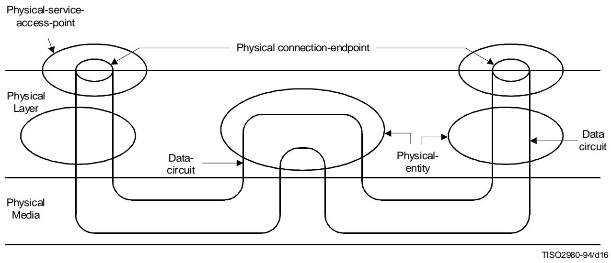

Figure 17 - Interconnection of data circuits within the Physical Layer

7.7.3.4.2 A physical-connection may allow duplex or half-duplex transmission of bit streams. 

# 7.7.3.5 Physical-connection-endpoints

7.7.3.5.1 The Physical Layer provides physical-connection-endpoint-identifiers which may be used by a data-link-entity to identify physical-connection-endpoints. 

7.7.3.5.2 A physical-connection will have two (point-to-point) or more (multi-endpoint) physical-connection-endpoints (see Figure 18). 

# 7.7.3.6 Data-circuit identification

The Physical Layer provides identifiers which uniquely specify the data-circuits between two adjacent open systems. 

NOTE - This identifier is used by network-entities in adjacent open systems to refer to data-circuits in their dialogue. 

# 7.7.3.7 Sequencing

The Physical Layer delivers bits in the same order in which they were submitted. 

# 7.7.3.8 Fault condition notification

Data-link-entities are notified of fault conditions detected within the Physical Layer. 

# 7.7.3.9 Quality of service parameters

The quality of service of a physical-connection is derived from the data-circuits forming it. The quality of service can be characterized by: 

a) error rate, where errors may arise from alteration, loss, creation, and other causes; 

b) service availability; 

c) transmission rate; and 

d) transit delay. 

# 7.7.4 Functions within the Physical Layer

7.7.4.1 The functions of the Physical Layer are determined by the characteristics of the underlying medium and are too diverse to allow categorization into connection-mode and connectionless-mode. 

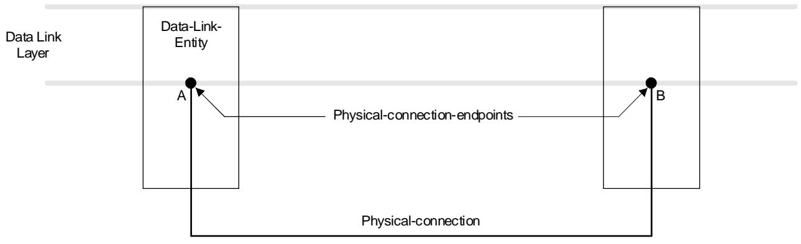

a) Example of a two endpoint physical connection (connection exists between A and B)

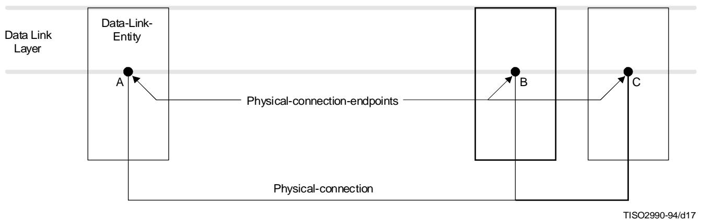

b) Example of a multi-endpoint-physical-connection (connection exists between A, B and C)

Figure 18 - Examples of physical connections

# 7.7.4.2 The functions provided by the Physical Layer are:

a) physical-connection activation and deactivation; 

b) physical-service-data-unit transmission; 

c) multiplexing; and 

d) Physical Layer management. 

# 7.7.4.3 Physical-connection activation and deactivation

These functions provide for the activation and deactivation of physical-connections between two data-link-entities upon request from the Data Link Layer. These include a relay function which provides for interconnection of data-circuits. 

# 7.7.4.4 Physical-service-data-unit transmission

The transmission of physical-service-data-units (i.e. bits) may be synchronous or asynchronous. Optionally, the function of physical-service-data-unit transmission provides recognition of the protocol-data-unit corresponding to a mutually agreed sequence of physical-service-data-units that are being transmitted. 

# 7.7.4.5 Multiplexing

This function provides for two or more physical-connections to be carried on a single data-circuit. This function provides the recognition of the framing required to enable identification of the PhDUs conveyed by the individual physical-connections over the single data-circuit. The multiplexing function is optional. 

NOTE - A particular example of the use of multiplexing is offered when a transmission media is divided into data-circuits in support of the different data link protocols used in the signalling phase and in the data transfer phase when using circuit switched subnetworks. In such usage of multiplexing, flows of different nature are permanently assigned to different elements of the multiplex group. 

# 7.7.4.6 Physical Layer management

7.7.4.6.1 The Physical Layer protocols deal with some management activities of the layer (such as activation and error control). See clause 8 and ITU-T Rec. X.700 | ISO 7498-4 for the relationship with other management aspects. 

NOTE - The above text deals with interconnection between open systems as illustrated in Figure 11. For open systems to communicate in the real environment, real physical connections should be made as, for example, in Figure 19 a). Their logical representation is as shown in Figure 19 b) and is called the physical media connection. The mechanical, electromagnetic and other media dependent characteristics of physical media connections are defined at the boundary between the Physical Layer and the physical media. Definitions of such characteristics are specified in other standards. 

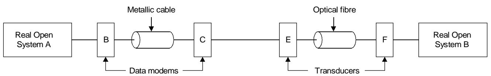

a) Real environment 

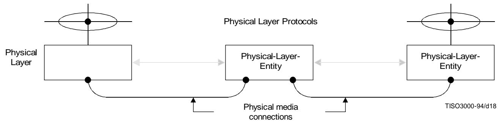

b) Logical environment 

NOTE - The area of physical media connections in OSI requires further study.

Figure 19 - Examples of interconnection

# 8 Management aspects of OSI

# 8.1 Definitions

8.1.1 application management: Functions in the Application Layer (see 6.1) related to the management of OSI application-processes. 

8.1.2 application management application-entity: An application-entity which executes application-management functions. 

8.1.3 OSI resources: Data processing and data communication resources which are of concern to OSI. 

8.1.4 systems management: Functions in the Application Layer related to the management of various OSI resources and their status across all layers of the OSI architecture. 

8.1.5 systems management application-entity: An application-entity for the purposes of systems-management communications. 

8.1.6 layer management: Functions related to the management of the (N)-layer partly performed in the (N)-layer itself according to the (N)-protocol of the layer (activities such as activation and error control) and partly performed as a subset of systems-management. 

# 8.2 Introduction

8.2.1 Within the OSI Reference Model, there is a need to recognize the special problems of initiating, terminating, and monitoring activities and assisting in their harmonious operations, as well as handling abnormal conditions. These have been collectively considered as the management aspects of the OSI architecture. These concepts are essential to the operation of the interconnected open systems. 

8.2.2 The management activities which are of concern are those which imply actual exchanges of information between open systems. Only the protocols needed to conduct such exchanges are candidates for standardization within the OSIE. 

8.2.3 This clause describes key concepts relevant to the management aspects, including the different categories of management activities and the positioning of such activities within the OSI Reference Model. 

8.2.4 Systems and layer management provide the initialization action to establish support for connectionless-mode services between systems. 

8.2.5 Management facilities may be provided to allow characteristics of the nature, quality and type of connectionless-mode service provided by a layer to be conveyed to the next higher layer prior to the invocation of that service. These facilities may provide this information either prior to any invocation of the service or at any time during a period when it is available. 

# 8.3 Categories of management activities

# 8.3.1 Introduction

8.3.1.1 Only those management activities which imply actual exchanges of information between remote management entities are pertinent to the OSI architecture. Other management activities local to particular open systems are outside its scope. 

8.3.1.2 Similarly, not all resources are pertinent to OSI. This International Standard considers only OSI resources, i.e. those data processing and data communication resources which are of concern to OSI. 

8.3.1.3 The following categories of management activities are identified: 

a) application management; 

b) systems management; and 

c) layer management. 

# 8.3.2 Application-management

8.3.2.1 Application-management relates to the management of OSI application-processes. The following list is typical of activities which fall into this category but it is not exhaustive: 

a) initialization of parameters representing application-processes; 

b) initiation, maintenance, and termination of application-processes; 

c) allocation and de-allocation of OSI resources to application-processes; 

d) detection and prevention of OSI resource interference and deadlock; 

e) integrity and commitment control; 

f) security control; and 

g) checkpointing and recovery control. 

8.3.2.2 The protocols for application-management reside within the Application Layer, and are handled by application-management-application-entities. 

# 8.3.3 Systems-management

8.3.3.1 Systems-management relates to the management of OSI resources and their status across all layers of the OSI Reference Model. The following list is typical of activities which fall into this category but it is not exhaustive: 

a) activation/deactivation management which includes: 

1) activation, maintenance, and termination of OSI resources distributed in open systems, including physical media for OSI: 

2) some program loading functions; 

3) establishment/maintenance/ release of connections between management entities; and 

4) open systems parameter initialization/modification; 

b) monitoring which includes: 

1) reporting status or status changes; and 

2) reporting statistics; and 

c) error control which includes: 

1) error detection and some of the diagnostic functions; and 

2) reconfiguration and restart. 

8.3.3.2 The protocols for systems-management reside in the application-layer, and are handled by systems-management-application-entities. 

# 8.3.4 Layer-management

8.3.4.1 There are two aspects of layer-management. One of these is concerned with layer activities such as activation and error control. This aspect is implemented by the layer protocol to which it applies. 

8.3.4.2 The other aspect of layer-management is a subset of systems-management. The protocols for these activities reside within the Application Layer and are handled by systems-management-application-entities. 

# 8.4 Principles for positioning management functions

Several principles are important in positioning management functions in the Reference Model of Open Systems Interconnection. They include the following:5) 

a) both centralization and decentralization of management functions are allowed. Thus, the OSI Reference Model does not dictate any particular fashion or degree of centralization of such functions. This principle calls for a structure in which each open system is allowed to include any (subset of) systems-management functions and each subsystem is allowed to include any (subset of) layer-management functions; 

b) if it is necessary, connections between management entities are established when an open system which has been operating in isolation from other open systems, becomes part of the OSIE. 

# 9 Compliance and Consistency with this reference model

# 9.1 Definitions

9.1.1 consistency: A "referencing" ITU-T Recommendation | International Standard is said to be consistent with a "referenced" ITU-T Recommendation | International Standard if it does not alter their meanings. 

9.1.2 compliance: A "referencing" ITU-T Recommendation | International Standard is said to comply with the applicable requirements of a "referenced" ITU-T Recommendation | International Standard if the following are true: 

a) the "referenced" ITU-T Recommendation | International Standard specifies requirements (using the verb "shall") which are applicable to the type of ITU-T Recommendation | International Standard of which the "referencing" ITU-T Recommendation | International Standard is an instance; 

b) the “referenced” ITU-T Recommendation | International Standard includes a compliance clause to clarify which requirements apply to the type of ITU-T Recommendation | International Standard of which the “referencing” ITU-T Recommendation | International Standard is an instance; 

c) the "referencing" ITU-T Recommendation | International Standard contains a claim of compliance to the "referenced" ITU-T Recommendation | International Standard; or 

d) it is possible by inspection of the "referencing" ITU-T Recommendation | International Standard to verify that the applicable requirements have been fulfilled. 

# 9.2 Application of consistency and compliance requirements

9.2.1 Other modelling ITU-T Recommendations | International Standards which extend or refine this Basic Reference Model shall be consistent with this part of it. 

9.2.2 Compliance and consistency with this Basic Reference Model is also applicable to ITU-T Recommendations, International standards and technical reports which describe or specify OSI functions. These ITU-T Recommendations, International standards and reports can be architecture documents, models, frameworks, service definitions, or protocol specifications. 

# 9.2.3 Consistency

9.2.3.1 An architecture, a framework, a multilayer model, a single layer model, a service definition, or a protocol specification consistent with this Basic Reference Model and other modelling ITU-T Recommendations | International Standards which extend or refine this Basic Reference Model shall state: 

"This architecture, multilayer model, single layer model, service description, or protocol specification: 

a) follows the architectural principles and prescriptions of the OSI Basic Reference Model (ITU-T Rec. X.200 | ISO/IEC 7498-1); 

b) uses the concepts established by the OSI Basic Reference Model (ITU-T Rec. X.200 | ISO/IEC 7498-1) with identical definitions and terminology." 

# 9.2.4 Compliance

# 9.2.4.1 Compliance of an architecture, framework, or multilayer model

An architecture, a framework, or a multilayer model compliant with this Basic Reference Model and other modeling ITU-T Recommendations | International Standards associated with this Basic Reference Model which refine this Basic Reference Model shall state: 

"This architecture, framework, or multilayer model is compliant with the OSI Basic Reference Model (ITU-T Rec. X.200 | ISO/IEC 7498-1) in that it describes operations and mechanisms which are assignable to layers as specified in the OSI Basic Reference Model." 

# 9.2.4.2 Compliance of a single layer model

A single layer model compliant with this OSI Basic Reference Model shall state: 

"This single layer standard is compliant with the OSI Basic Reference Model (ITU-T Rec. X.200 | ISO/IEC 7498-1) in that it describes operations and mechanisms which pertain to a particular layer as specified in the relevant subclause of clause 7 of the OSI Basic Reference Model." 

# 9.2.4.3 Compliance of a service definition

A service definition compliant with OSI Basic Reference Model shall state: 

"This service definition is compliant with the OSI Basic Reference Model (ITU-T Rec. X.200 | ISO/IEC 7498-1) in that it describes facilities which pertain to a particular layer as specified in the relevant subclause of clause 7 of the OSI Basic Reference Model." 

# 9.2.4.4 Compliance of a protocol specification

A protocol specification compliant with the OSI Basic Reference Model shall state: 

"This protocol specification is compliant with the OSI Basic Reference Model (ITU-T Rec. X.200 | ISO/IEC 7498-1) in that it describes functions which pertain to a particular layer as specified in the relevant subclause of clause 7 of the OSI Basic Reference Model." 

# Annex A Brief explanation of how the layers were chosen

(This annex does not form an integral part of this Recommendation | International Standard) 

A.1 This annex provides elements giving additional information to this Recommendation | International Standard. 

A.2 The following is a brief explanation of how the layers were chosen: 

A.2.1 It is essential that the architecture permits usage of a realistic variety of physical media for interconnection with different control procedures (for example ITU-T Recs. V.24, V.25, etc.). Application of principles in 6.2 c), e) and h) leads to identification of a Physical Layer as the lowest layer in the architecture. 

A.2.2 Some physical communication media (for example, telephone line) require specific techniques to be used in order to transmit data between systems despite a relatively high error rate (i.e. an error rate not acceptable for the great majority of applications). These specific techniques are used in data-link control procedures which have been studied and standardized for a number of years. It must also be recognized that new physical communication media (for example, fibre optics) will require different data-link control procedures. Application of principles in 6.2 c), e) and h) leads to identification of a Data Link Layer on top of the Physical Layer in the architecture. 

A.2.3 In the open systems architecture, some open systems will act as the final destination of data, see clause 4. Some open systems may act only as intermediate nodes [(forwarding data to other systems) (see Figure 13)]. Application of principles in 6.2 c), e) and g) leads to identification of a Network Layer on top of the Data Link Layer. Network oriented protocols such as routing, for example, will be grouped in this layer. Thus, the Network Layer will provide a connection path (network-connection) between a pair transport-entities; including the case where intermediate nodes are involved, see Figure 12 (see also 7.5.4.2). 

A.2.4 Control of data transportation from source end open system to destination end open system (which is not performed in intermediate nodes) is the last function to be performed in order to provide the totality of the transport-service. Thus, the upper layer in the transport-service part of the architecture is the Transport Layer, on top of the Network Layer. This Transport Layer relieves higher layer entities from any concern with the transportation of data between them. 

A.2.5 There is a need to organize and synchronize dialogue, and to manage the exchange of data. Application of principles in 6.2 c) and d) leads to the identification of a Session Layer on top of the Transport Layer. 

A.2.6 The remaining set of general interest functions are those related to representation and manipulation of structured data for the benefit of application programs. Application of principles in 6.2 c) and d) leads to identification of a Presentation Layer on top of the Session Layer. 

A.2.7 Finally, there are applications consisting of application-processes which perform information processing. An aspect of these application-processes and the protocols by which they communicate comprise the Application Layer as the highest layer of the architecture. 

A.3 The resulting architecture with seven layers, illustrated in Figure 11, obeys the principles in 6.2 a) and b). 

A more detailed definition of each of the seven layers identified above is given in clause 7 of this Recommendation | International Standard, starting from the top with the Application Layer described in 7.1 down to the Physical Layer described in 7.7. 

Annex B
Alphabetical index to definitions

(This annex forms an integral part of this Recommendation | International Standard) 

<table><tr><td>Term</td><td>Subclause</td><td>Page</td></tr><tr><td>abstract syntax</td><td>7.1.1.2</td><td>32</td></tr><tr><td>acknowledgement</td><td>5.8.1.16</td><td>17</td></tr><tr><td>(N)-address</td><td>5.4.1.1</td><td>13</td></tr><tr><td>(N)-address-mapping</td><td>5.4.1.3</td><td>13</td></tr><tr><td>application-entity</td><td>7.1.1.1</td><td>32</td></tr><tr><td>application-management</td><td>8.1.1</td><td>52</td></tr><tr><td>application-management-application-entity</td><td>8.1.2</td><td>52</td></tr><tr><td>application-process</td><td>4.1.4</td><td>2</td></tr><tr><td>application-process-invocation</td><td>4.1.7</td><td>2</td></tr><tr><td>application-process-type</td><td>4.1.8</td><td>2</td></tr><tr><td>(N)-association</td><td>5.3.1.1</td><td>9</td></tr><tr><td>blocking</td><td>5.8.1.11</td><td>17</td></tr><tr><td>centralized multi-endpoint-connection</td><td>5.8.1.2</td><td>16</td></tr><tr><td>compliance</td><td>9.1.2</td><td>54</td></tr><tr><td>concatenation</td><td>5.8.1.13</td><td>17</td></tr><tr><td>concrete syntax</td><td>7.2.1.1</td><td>33</td></tr><tr><td>(N)-connection</td><td>5.3.1.2</td><td>9</td></tr><tr><td>(N)-connection-endpoint</td><td>5.3.1.3</td><td>9</td></tr><tr><td>(N)-connection-endpoint-identifier</td><td>5.4.1.5</td><td>13</td></tr><tr><td>(N)-connection-endpoint-suffix</td><td>5.4.1.6</td><td>13</td></tr><tr><td>(N)-connection-mode-transmission</td><td>5.3.1.17</td><td>9</td></tr><tr><td>(N)-connectionless-mode-transmission</td><td>5.3.1.18</td><td>9</td></tr><tr><td>consistency</td><td>9.1.1</td><td>54</td></tr><tr><td>correspondent (N)-entities</td><td>5.3.1.5</td><td>9</td></tr><tr><td>data-circuit</td><td>7.7.1.1</td><td>49</td></tr><tr><td>(N)-data communication</td><td>5.3.1.13</td><td>9</td></tr><tr><td>(N)-data sink</td><td>5.3.1.8</td><td>9</td></tr><tr><td>(N)-data source</td><td>5.3.1.7</td><td>9</td></tr><tr><td>(N)-data transmission</td><td>5.3.1.9</td><td>9</td></tr><tr><td>deblocking</td><td>5.8.1.12</td><td>17</td></tr><tr><td>decentralized multi-endpoint-connection</td><td>5.8.1.3</td><td>16</td></tr><tr><td>demultiplexing</td><td>5.8.1.5</td><td>17</td></tr><tr><td>duplex mode</td><td>7.3.1.2</td><td>34</td></tr><tr><td>(N)-duplex transmission</td><td>5.3.1.10</td><td>9</td></tr><tr><td>(N)-entity</td><td>5.2.1.11</td><td>6</td></tr><tr><td>(N)-entity-invoiceation</td><td>5.2.1.12</td><td>6</td></tr><tr><td>(N)-entity-type</td><td>5.2.1.10</td><td>6</td></tr><tr><td>(N)-entity-title</td><td>5.4.1.10</td><td>13</td></tr><tr><td>expedited (N)-service-data-unit</td><td>5.6.1.6</td><td>15</td></tr><tr><td>(N)-expedited-data-unit</td><td>5.6.1.6</td><td>15</td></tr><tr><td>(N)-facility</td><td>5.2.1.6</td><td>6</td></tr><tr><td>flow control</td><td>5.8.1.8</td><td>17</td></tr><tr><td>(N)-function</td><td>5.2.1.7</td><td>6</td></tr><tr><td>half duplex mode</td><td>7.3.1.3</td><td>34</td></tr><tr><td>(N)-half-duplex transmission</td><td>5.3.1.11</td><td>9</td></tr><tr><td>(N)-layer</td><td>5.2.1.2</td><td>6</td></tr><tr><td>layer-management</td><td>8.1.6</td><td>53</td></tr><tr><td>local system environment (LSE)</td><td>4.1.6</td><td>2</td></tr><tr><td>multi-connection-endpoint-identifier</td><td>5.4.1.7</td><td>13</td></tr><tr><td>multi-endpoint-connection</td><td>5.3.1.4</td><td>9</td></tr><tr><td>multiplexing</td><td>5.8.1.4</td><td>16</td></tr><tr><td>(N)-one-way communication</td><td>5.3.1.16</td><td>9</td></tr><tr><td>open system</td><td>4.1.3</td><td>2</td></tr><tr><td>open system interconnection environment (OSIE)</td><td>4.1.5</td><td>2</td></tr><tr><td>OSI end system</td><td>6.5.1.1</td><td>31</td></tr><tr><td>OSI-(N)-relay system</td><td>6.5.1.2</td><td>31</td></tr><tr><td>OSI resources</td><td>8.1.3</td><td>53</td></tr><tr><td>peer-(N)-entities</td><td>5.2.1.3</td><td>6</td></tr><tr><td>presentation context</td><td>7.2.1.3</td><td>33</td></tr><tr><td>(N)-protocol</td><td>5.2.1.9</td><td>6</td></tr><tr><td>(N)-protocol-connection-identifier</td><td>5.4.1.9</td><td>13</td></tr><tr><td>(N)-protocol-control-information (PCI)</td><td>5.6.1.1</td><td>15</td></tr><tr><td>(N)-protocol-data-unit (PDU)</td><td>5.6.1.3</td><td>15</td></tr><tr><td>(N)-protocol-identifier</td><td>5.8.1.1</td><td>16</td></tr><tr><td>(N)-protocol-version-identifier</td><td>5.8.1.18</td><td>17</td></tr><tr><td>real system</td><td>4.1.1</td><td>2</td></tr><tr><td>real open system</td><td>4.1.2</td><td>2</td></tr><tr><td>real subnetwork</td><td>7.5.1.1</td><td>41</td></tr><tr><td>reassembling</td><td>5.8.1.10</td><td>17</td></tr><tr><td>recombining</td><td>5.8.1.7</td><td>17</td></tr><tr><td>(N)-relay</td><td>5.3.1.6</td><td>9</td></tr><tr><td>reset</td><td>5.8.1.17</td><td>17</td></tr><tr><td>routing</td><td>5.4.1.4</td><td>13</td></tr><tr><td>segmenting</td><td>5.8.1.9</td><td>17</td></tr><tr><td>separation</td><td>5.8.1.14</td><td>17</td></tr><tr><td>sequencing</td><td>5.8.1.15</td><td>17</td></tr><tr><td>(N)-service</td><td>5.2.1.5</td><td>6</td></tr><tr><td>(N)-service-access-point (SAP)</td><td>5.2.1.8</td><td>6</td></tr><tr><td>(N)-service-access-point-address</td><td>5.4.1.2</td><td>13</td></tr><tr><td>(N)-service-connection-identifier</td><td>5.4.1.8</td><td>13</td></tr><tr><td>(N)-service-data-unit (SDU)</td><td>5.6.1.4</td><td>15</td></tr><tr><td>session-connection synchronization</td><td>7.3.1.4</td><td>35</td></tr><tr><td>(N)-simplex transmission</td><td>5.3.1.12</td><td>9</td></tr><tr><td>splitting</td><td>5.8.1.6</td><td>17</td></tr><tr><td>sublayer</td><td>5.2.1.4</td><td>6</td></tr><tr><td>subnetwork</td><td>7.5.1.2</td><td>41</td></tr><tr><td>subnetwork-connection</td><td>7.5.1.3</td><td>41</td></tr><tr><td>(N)-subsystem</td><td>5.2.1.1</td><td>6</td></tr><tr><td>systems-management</td><td>8.1.4</td><td>53</td></tr><tr><td>systems-management-application-entity</td><td>8.1.5</td><td>53</td></tr><tr><td>token management</td><td>7.3.1.1</td><td>34</td></tr><tr><td>transfer syntax</td><td>7.2.1.2</td><td>33</td></tr><tr><td>(N)-two-way alternate communication</td><td>5.3.1.15</td><td>9</td></tr><tr><td>(N)-two-way simultaneous communication</td><td>5.3.1.14</td><td>9</td></tr><tr><td>N)-user-data</td><td>5.6.1.2</td><td>15</td></tr></table>